# SIGMATIQ UI Implementation Guide (Developer Edition)

Purpose: Provide concrete, end-to-end guidance to implement Sigma Lab’s UI with zero ambiguity. This document ties specs to actual code in `sigma-lab/ui/src/**`, defines component contracts, routes, tokens, storage keys, and API shapes.

What this covers
- App shell and navigation behavior, including accessibility details
- Theme/density/accent tokens and persistence
- Page routes and how they map to existing components
- Command Palette, keyboard shortcuts, and JSON configs
- API client contracts and example payloads
- State, error, loading, and empty patterns (uniform across pages)
- Performance, testing, and acceptance

References
- AppShell platform: `products/sigma-lab/docs/ui/AppShell_Platform_v1.md`
- Tokens checklist: `products/sigma-lab/docs/ui/Design_Tokens_Checklist.md`
- Requirements: `products/sigma-lab/docs/ui/Sigma_Lab_UI_Requirements_v1.md`
- Wireframes: `products/sigma-lab/docs/ui/Sigma_Lab_UI_Wireframes_v1.md`

Project Overview
- Stack: React + TypeScript + Vite; CSS modules/simple CSS files under `src/styles/**`.
- Entry: `sigma-lab/ui/src/main.tsx` mounts `AppShell` and routes.
- Shell: `src/layouts/AppShell.tsx` with topbar, sidebar, main content, command palette.
- API: `src/services/api.ts` wraps Axios with `/api` base and auth header support.
- Config: `src/config/menu.ts` drives navigation tree; `implementedPaths` disables not-yet-implemented links.
- Components: `src/components/**` includes UI primitives (buttons, cards, badges, tables) and specialized widgets.

Directory Structure (actual)
```
sigma-lab/ui/src/
├── assets/
├── components/
│   ├── ui/              # Button, Badge, Card, Tooltip, GateBadge, etc.
│   ├── forms/           # Input, Select, Toggle, etc.
│   ├── data-display/    # DataGrid
│   ├── feedback/        # Alert, EmptyState, ErrorState
│   ├── navigation/      # Tabs, Pagination
│   ├── CommandPalette.tsx(.css)
│   ├── Icon.tsx, Logo.tsx, index.ts
├── config/menu.ts
├── contexts/            # ThemeContext, UIContext
├── layouts/AppShell.tsx(.css)
├── pages/               # Dashboard, Models, ModelCreate, Designer, Composer, Sweeps, Leaderboard, Signals, Health, Overlay
├── services/api.ts
├── styles/              # global.css, themes.css, extracted-theme.css
└── App.tsx, main.tsx
```

Routing and Navigation
- Router paths (React Router) correspond to menu items in `config/menu.ts`.
- Each `MenuItem` maps to a normalized `path` (hash removed). Disabled links are determined by `implementedPaths` via simple `:param` matching.
- Active route exact-match only; ancestor chain auto-expands in the sidebar.
- Keyboard and ARIA:
  - Skip link: focusable `#main-content` anchor is present.
  - Sidebar has `role="navigation"` and aria-label “Primary”.
  - Active item has `aria-current="page"` on `<Link>`.
  - Sidebar collapse/expand button includes `aria-label` and `title` reflecting state.

Header, Keyboard, and Command Palette
- Header controls: Dashboard switch (placeholder), Theme toggle, Command Palette button.
- Keyboard: global `(Ctrl|⌘)+K` toggles Command Palette (`components/CommandPalette.tsx`).
- Palette source of truth: `products/sigma-lab/docs/ui/command_palette.json`. Implement a loader or hardcode initial commands aligned with this file. Required fields per item: `command`, `route` or `routeTemplate`, `requiresModel`, `hover`, optional `api` references.
- Palette a11y: `role="dialog"`, labelled title, ESC closes, focus trap inside component. Provide `onClose()` prop and `isOpen` boolean.

Theme, Density, and Accent
- Theme context: `contexts/ThemeContext.tsx` exposes `theme`, `setTheme`, `cycleTheme`, `currentThemeConfig`.
- Themes supported: `dark | midnight | light | slate`. Persisted key: `localStorage['theme']`. HTML attribute: `data-theme` set by context effect.
- Density (global): add `data-density` on `<html>` mirroring `AppShell_Platform_v1.md` values `compact|cozy|comfortable`; persist as `localStorage['ui.density']`. Pattern: apply density to spacing via CSS variables (`--padding`, `--font-size`).
- Accent (per pack): set `data-sigma` at `<html>` or page wrapper; derive `--accent` token per design tokens.
- Focus ring: visible on all interactive via `:focus-visible` implementing `--ring` variable.

Design Tokens and CSS
- Use tokens listed in `Design_Tokens_Checklist.md`. Do not hardcode colors in components; reference CSS custom properties.
- Styles live in `src/styles/**` and component-local CSS files. Keep surfaces/text consistent across themes.
- Suggested mapping:
  - Surfaces: `--surface-1` (cards, table bg), `--surface-2` (containers), `--bg-hover` (item hover).
  - Text: `--text-primary`, `--text-secondary`, `--text-muted`, `--text-inverse`.
  - Status: `--status-success`, `--status-warning`, `--status-error`.
  - Borders: `--border-color`, `--border-strong`.

State, Storage, and Global UX
- Storage keys:
  - `theme` (string: ThemeName)
  - `ui.density` (string: compact|cozy|comfortable)
  - `auth_token` (string; axios Authorization header)
  - Optional: `risk.profile` (Conservative|Balanced|Aggressive), `selection.cart` (JSON array)
- Global patterns:
  - Loading: show spinners/skeletons via `feedback` components.
  - Empty: concise message + suggested action.
  - Error: banner with short reason, retry, and preserve filters/inputs.
  - Toasts: use a centralized `ToastCenter` (to be implemented) for success/error.

API Client Contracts (`services/api.ts`)
- Base URL `/api`; request/response interceptors already implemented (auth + 401 handling).
- Methods exposed:
  - Health: `getHealth(): GET /health`
  - Models: `getModels(params)`, `getModelDetail(model_id, pack_id)`, `createModel({ template_id, name, risk_profile })`
  - Leaderboard: `getLeaderboard(params)` with `{ model_id?, pack_id?, tag?, risk_profile?, pass_gate?, limit?, offset? }`
  - Signals: `getSignals(params)` and `getOptionSignals(params)`
  - Indicator Sets: `getIndicatorSets()`
  - Pipeline: `buildMatrix`, `previewMatrix`, `train`, `backtest`, `backtestSweep`
  - Calibration: `calibrateThresholds`
  - Scan: `scan`
  - Policy: `explainPolicy(model_id, pack_id)`

Types and Example Payloads
- Leaderboard row (example minimal):
```ts
type LeaderboardRow = {
  id?: string
  model_id: string
  pack_id: string
  metrics?: { sharpe?: number; cum_ret?: number; win_rate?: number; trades?: number; max_drawdown?: number }
  gate?: { pass: boolean; reasons?: string[] }
  lineage?: { matrix_sha?: string; config_sha?: string; policy_sha?: string; risk_profile?: string; risk_sha?: string }
  tag?: string
  started_at?: string
}
```
- Sweeps request:
```ts
interface BacktestSweepBody {
  model_id: string
  risk_profile: 'Conservative'|'Balanced'|'Aggressive'
  sweep: {
    thresholds_variants?: number[][]   // e.g., [[0.50,0.55,0.60]]
    hours_variants?: number[][]        // e.g., [[13,14],[13,14,15]]
    top_pct_variants?: number[][]      // e.g., [[0.10,0.15]]
  }
  tag?: string
}
```
- Backtest request:
```ts
interface BacktestBody {
  model_id: string
  pack_id: string
  config?: { kind: 'thr'|'top_pct'; value: number; allowed_hours?: number[]; splits?: number }
  matrix_sha?: string
}
```
- Build request:
```ts
interface BuildBody { model_id: string; pack_id: string; start: string; end: string }
```
- Train request:
```ts
interface TrainBody { model_id: string; pack_id: string; csv?: string; calibration?: any }
```

Pages and Components (mapping to code)
- Dashboard: `pages/Dashboard.tsx` (cards for Recent Models, Last Runs, Quick Actions, Health). Uses `feedback` components for loading/empty.
- Models: `pages/Models.tsx` + `pages/Models.css` implements list with search, pack filter, sorting, and actions linking to Designer/Composer/Sweeps/Backtest.
- ModelCreate (Template Picker): `pages/ModelCreate.tsx` with steps and Create actions.
- Designer: `pages/ModelDesigner.tsx` (edit indicator set/policy; integrate validation and explain hooks per Assistant spec).
- Composer: `pages/Composer.tsx` hosts tabs Build/Backtest/Train and links to leaderboard. Ensure `Matrix Profile` modal and payload echo.
- Sweeps: `pages/Sweeps.tsx` contains risk profile, configuration, what-if panel, results table with Gate badges and actions (Add/Compare, Export CSV).
- Leaderboard: `pages/Leaderboard.tsx` filters and table with selection + batch actions; performance summary at bottom.
- Signals: `pages/Signals.tsx` with tabs Leaderboard | Log | Analytics.
- Health: `pages/Health.tsx`; Overlay: `pages/Overlay.tsx`.

UI Primitives and Contracts (selected)
- Button: `components/ui/Button.tsx(.css)` variants `btn btn-primary|secondary|ghost`, `btn-sm` size; respect `:focus-visible`.
- Badge: `components/ui/Badge.tsx(.css)` variants `badge-success|error|warning|pack-<id>`.
- GateBadge: `components/ui/GateBadge.tsx(.css)` unify PASS/FAIL with reason tooltip on hover/focus.
- Tooltip: `components/ui/Tooltip.tsx(.css)` uses aria-describedby, appears on focus and hover.
- DataGrid/Table: `components/data-display/DataGrid.tsx(.css)` or page-local tables; sticky headers with tokens.
- Tabs: `components/navigation/Tabs.tsx(.css)` keyboard accessible.

Accessibility Checklist (apply to all pages)
- Use semantic landmarks: header, nav, main, footer.
- Every interactive has visible focus via `:focus-visible` and an accessible name.
- Tables: `scope="col"` for headers; rows focusable when clickable.
- Tooltips: appear on keyboard focus and be dismissible; do not trap focus.
- Dialogs (palette/modals): focus trap, ESC closes, aria-labelledby/aria-describedby.

Performance and UX Budgets
- Page load ≤ 2s for primary list views (Dashboard, Models, Leaderboard with ≤ 50 rows).
- Use skeletons for lists/cards; defer heavy charts; lazy-load non-critical modules.
- Avoid layout shifts; reserve space for async content.

Testing Guidance
- Unit: test ThemeContext, density switching, and selection cart persistence.
- Integration: mock API responses for Models and Leaderboard; verify filters affect API params.
- E2E: keyboard nav through topbar and sidebar; palette opens on ⌘K; theme persists after reload.

Acceptance Summary (cross-check with Requirements)
- Navigation disables unimplemented routes via `implementedPaths`.
- Theme toggle cycles `dark → midnight → light → slate`; persists in `localStorage['theme']` and updates `data-theme`.
- Sweeps shows Risk Profile presets, allows running sweeps, renders Gate badges with reasons, and supports CSV export.
- Leaderboard filters, supports “Pass Gate only”, selection + Train Selected action stubbed.
- Build/Backtest/Train in Composer echo payloads and show success/error with retries.

Notes and Next Steps
- Align `menu.json` and `config/menu.ts` periodically; add a dev script to validate parity.
- Expand `services/api.ts` types and narrow `any` where feasible.
- Wire Assistant hooks per `Assistant_Hooks_and_Integrations.md` (data-ai-hook attributes and context packet builder).

### P0 Components (Must Have - Implement First)

#### 1. Navigation Shell with Auto-Collapse
```jsx
// layouts/AppShell.jsx
import { Header, Sidebar, CommandPalette, QuickAccessDrawer } from '../components/core';

const AppShell = ({ children }) => (
  <div className="app-shell">
    <Header />
    <div className="main-layout">
      <Sidebar />
      <main className="content-area" id="main-content">
        {children}
      </main>
    </div>
    <CommandPalette />
    <QuickAccessDrawer />
  </div>
);
```

#### 2. Dashboard
```jsx
// pages/Dashboard.jsx
import { RecentModels, LastRuns, QuickActions, HealthStatus } from '../components/core/dashboard';

const Dashboard = () => (
  <div className="dashboard-grid">
    <DashboardCard title="System Overview">
      <HealthStatus />
    </DashboardCard>
    <DashboardCard title="Recent Activity">
      <RecentModels />
    </DashboardCard>
    <DashboardCard title="Performance Summary">
      <PerformanceMetrics />
    </DashboardCard>
  </div>
);
```

#### 3. Models List with Toggle View
```jsx
// components/core/ModelsList.jsx
const ModelsList = () => {
  const [viewType, setViewType] = useState('card');
  
  return (
    <>
      <ControlsBar onViewChange={setViewType} />
      {viewType === 'row' && <TableHeader />}
      <div className={`cards-container ${viewType}-view`}>
        {models.map(model => (
          viewType === 'card' 
            ? <ModelCard key={model.id} {...model} />
            : <ModelRow key={model.id} {...model} />
        ))}
      </div>
      <Pagination />
    </>
  );
};
```

#### 4. Create Model Wizard (3-Step)
```jsx
// components/core/CreateModelWizard.jsx
const CreateModelWizard = () => {
  const [step, setStep] = useState(1);
  
  return (
    <div className="wizard">
      <WizardSteps current={step} />
      {step === 1 && <TemplateSelector onSelect={handleTemplate} />}
      {step === 2 && <ConfigureModel template={selectedTemplate} />}
      {step === 3 && <ReviewAndCreate onConfirm={handleCreate} />}
    </div>
  );
};
```

#### 5. Build/Train/Backtest Tabs
```jsx
// components/core/BTBTabs.jsx
const BTBTabs = () => {
  const [activeTab, setActiveTab] = useState('build');
  
  return (
    <div className="btb-container">
      <TabNav tabs={['build', 'train', 'backtest']} onChange={setActiveTab} />
      {activeTab === 'build' && <BuildForm />}
      {activeTab === 'train' && <TrainForm />}
      {activeTab === 'backtest' && <BacktestForm />}
    </div>
  );
};
```

### P1 Components (Implement Second)

#### 6. Signals with Tabs
```jsx
// pages/Signals.jsx
const Signals = () => {
  const [activeTab, setActiveTab] = useState('leaderboard');
  
  return (
    <div className="signals-container">
      <TabNav tabs={['leaderboard', 'log', 'analytics']} onChange={setActiveTab} />
      {activeTab === 'leaderboard' && <SignalsLeaderboard />}
      {activeTab === 'log' && <SignalsLog />}
      {activeTab === 'analytics' && <SignalsAnalytics />}
    </div>
  );
};
```

#### 7. Options Overlay
```jsx
// components/analytics/OptionsOverlay.jsx
const OptionsOverlay = () => (
  <div className="options-overlay-container">
    <StrategySelector />
    <OptionsParameters />
    <ParitySummary />
    <OptionsChainPreview />
    <ActionButtons />
  </div>
);
```

### P2 Admin Components (Implement Last)

#### 8. Admin Layout
```jsx
// layouts/AdminLayout.jsx
const AdminLayout = ({ children }) => (
  <div className="admin-container">
    <AdminNotice />
    <AdminNav />
    {children}
  </div>
);
```

## 📱 Responsive Implementation

### Mobile Breakpoints
```css
/* Mobile First Approach */
@media (min-width: 768px) {
  .cards-container.card-view {
    grid-template-columns: repeat(auto-fill, minmax(280px, 1fr));
  }
  .sidebar { 
    position: relative;
    transform: translateX(0);
  }
}

@media (max-width: 767px) {
  .sidebar { 
    position: fixed;
    transform: translateX(-100%);
    top: var(--header-height);
  }
  .sidebar.active {
    transform: translateX(0);
  }
  .mobile-tab-bar { 
    display: flex;
  }
}
```

### Touch Optimization
```css
.btn, .card, .nav-item, .icon-btn {
  min-height: 44px; /* iOS touch target */
  -webkit-tap-highlight-color: transparent;
}

.card {
  touch-action: pan-y;
  user-select: none;
}
```

## 🎯 Implementation Priority Order

### Phase 1: Core Structure (Week 1)
- [x] Set up project structure and routing
- [x] Implement theme/design tokens
- [x] Create Logo and Icon components
- [x] Build AppShell with Single Header
- [x] Implement Auto-Collapse Sidebar
- [x] Add Quick Access Drawer (icon-only)
- [x] Add Command Palette (⌘K)

### Phase 2: P0 Components (Week 2-3)
- [ ] Dashboard with all cards
- [ ] Models List with card/row toggle
- [ ] Create Model Wizard (3-step)
- [ ] Build/Train/Backtest forms
- [ ] Sweeps with What-If controls
- [ ] Leaderboard with Gate badges
- [ ] Selection Cart
- [ ] AI Assistant panel
- [ ] WebSocket alerts
- [ ] Loading/Empty/Error states

### Phase 3: P1 Components (Week 4)
- [ ] Signals (Leaderboard, Log, Analytics)
- [ ] Options Overlay
- [ ] Health/Status page
- [ ] Performance Tab with charts
- [ ] Templates Gallery

### Phase 4: P2 Admin (Week 5)
- [ ] Admin Jobs management
- [ ] Quotas & Limits
- [ ] Risk Profiles management
- [ ] Packs Manager
- [ ] Templates Manager
- [ ] Feature Flags
- [ ] Data Health
- [ ] Audit & Logs
- [ ] Users & Roles

## 🔌 API Integration Points

### Data Fetching Pattern
```javascript
// services/api.js
const API_BASE = process.env.REACT_APP_API_URL || 'http://localhost:8080';

export const api = {
  models: {
    list: (params) => fetch(`${API_BASE}/models?${new URLSearchParams(params)}`),
    create: (data) => fetch(`${API_BASE}/models`, { 
      method: 'POST', 
      headers: { 'Content-Type': 'application/json' },
      body: JSON.stringify(data) 
    }),
    get: (id) => fetch(`${API_BASE}/models/${id}`),
    update: (id, data) => fetch(`${API_BASE}/models/${id}`, {
      method: 'PATCH',
      headers: { 'Content-Type': 'application/json' },
      body: JSON.stringify(data)
    }),
  },
  sweeps: {
    run: (data) => fetch(`${API_BASE}/backtest_sweep`, { 
      method: 'POST',
      headers: { 'Content-Type': 'application/json' },
      body: JSON.stringify(data) 
    }),
  },
  leaderboard: {
    get: (params) => fetch(`${API_BASE}/leaderboard?${new URLSearchParams(params)}`),
  },
  build: {
    matrix: (data) => fetch(`${API_BASE}/build_matrix`, {
      method: 'POST',
      headers: { 'Content-Type': 'application/json' },
      body: JSON.stringify(data)
    }),
  },
  train: {
    start: (data) => fetch(`${API_BASE}/train`, {
      method: 'POST',
      headers: { 'Content-Type': 'application/json' },
      body: JSON.stringify(data)
    }),
    batch: (selections) => fetch(`${API_BASE}/train/batch`, {
      method: 'POST',
      headers: { 'Content-Type': 'application/json' },
      body: JSON.stringify(selections)
    }),
  },
  signals: {
    leaderboard: (params) => fetch(`${API_BASE}/signals/leaderboard?${new URLSearchParams(params)}`),
    log: (params) => fetch(`${API_BASE}/signals?${new URLSearchParams(params)}`),
    summary: (params) => fetch(`${API_BASE}/signals/summary?${new URLSearchParams(params)}`),
  },
  health: {
    check: () => fetch(`${API_BASE}/healthz`),
  }
};
```

### WebSocket Connection
```javascript
// services/websocket.js
class WebSocketService {
  constructor() {
    this.ws = null;
    this.subscribers = new Set();
  }

  connect() {
    this.ws = new WebSocket(process.env.REACT_APP_WS_URL || 'ws://localhost:8080/ws');
    
    this.ws.onmessage = (event) => {
      const data = JSON.parse(event.data);
      this.notify(data);
    };
    
    this.ws.onclose = () => {
      // Reconnect after 3 seconds
      setTimeout(() => this.connect(), 3000);
    };
  }

  subscribe(callback) {
    this.subscribers.add(callback);
    return () => this.subscribers.delete(callback);
  }

  notify(data) {
    this.subscribers.forEach(callback => callback(data));
  }
}

export const wsService = new WebSocketService();
```

## 🚀 State Management

### Context for Global State
```jsx
// contexts/AppContext.jsx
const AppContext = createContext();

export const AppProvider = ({ children }) => {
  const [theme, setTheme] = useState('dark');
  const [riskProfile, setRiskProfile] = useState('balanced');
  const [selectionCart, setSelectionCart] = useState([]);
  const [commandPaletteOpen, setCommandPaletteOpen] = useState(false);
  const [currentDashboard, setCurrentDashboard] = useState(0);
  
  // Keyboard shortcuts
  useEffect(() => {
    const handleKeyDown = (e) => {
      if ((e.metaKey || e.ctrlKey) && e.key === 'k') {
        e.preventDefault();
        setCommandPaletteOpen(true);
      }
      if (e.key === 'Escape') {
        setCommandPaletteOpen(false);
      }
    };
    
    window.addEventListener('keydown', handleKeyDown);
    return () => window.removeEventListener('keydown', handleKeyDown);
  }, []);
  
  return (
    <AppContext.Provider value={{
      theme, setTheme,
      riskProfile, setRiskProfile,
      selectionCart, setSelectionCart,
      commandPaletteOpen, setCommandPaletteOpen,
      currentDashboard, setCurrentDashboard,
    }}>
      {children}
    </AppContext.Provider>
  );
};
```

## ⚡ Performance Optimizations

### Code Splitting
```javascript
// Lazy load heavy components
import { lazy, Suspense } from 'react';

const SignalsAnalytics = lazy(() => import('./components/analytics/SignalsAnalytics'));
const AdminDashboard = lazy(() => import('./pages/admin/Dashboard'));
const PerformanceTab = lazy(() => import('./components/analytics/PerformanceTab'));

// Usage with loading fallback
<Suspense fallback={<LoadingSpinner />}>
  <SignalsAnalytics />
</Suspense>
```

### Virtualization for Large Lists
```jsx
// For tables with 1000+ rows
import { FixedSizeList } from 'react-window';

const VirtualizedTable = ({ data }) => (
  <FixedSizeList
    height={600}
    itemCount={data.length}
    itemSize={48}
    width="100%"
  >
    {({ index, style }) => (
      <div style={style}>
        <ModelRow {...data[index]} />
      </div>
    )}
  </FixedSizeList>
);
```

### Debounced Search
```javascript
// hooks/useDebounce.js
const useDebounce = (value, delay = 300) => {
  const [debouncedValue, setDebouncedValue] = useState(value);
  
  useEffect(() => {
    const timer = setTimeout(() => setDebouncedValue(value), delay);
    return () => clearTimeout(timer);
  }, [value, delay]);
  
  return debouncedValue;
};
```

## 🧪 Testing Strategy

### Component Testing
```javascript
// __tests__/ModelCard.test.js
import { render, screen } from '@testing-library/react';
import ModelCard from '../components/core/ModelCard';

test('ModelCard displays correct metrics', () => {
  const mockModel = {
    id: 'spy_opt_0dte_hourly',
    sharpe: 2.41,
    totalReturn: 24.5,
    winRate: 58,
    trades: 142
  };
  
  render(<ModelCard {...mockModel} />);
  
  expect(screen.getByText('2.41')).toBeInTheDocument(); // Sharpe
  expect(screen.getByText('+24.5%')).toBeInTheDocument(); // Return
  expect(screen.getByText('58%')).toBeInTheDocument(); // Win Rate
  expect(screen.getByText('142')).toBeInTheDocument(); // Trades
});
```

### Integration Testing
```javascript
// __tests__/Dashboard.integration.test.js
test('Dashboard loads and displays all sections', async () => {
  render(<Dashboard />);
  
  expect(await screen.findByText('System Overview')).toBeInTheDocument();
  expect(await screen.findByText('Recent Activity')).toBeInTheDocument();
  expect(await screen.findByText('Performance Summary')).toBeInTheDocument();
});
```

### Accessibility Testing
```javascript
// __tests__/accessibility.test.js
import { axe, toHaveNoViolations } from 'jest-axe';
expect.extend(toHaveNoViolations);

test('Header should be accessible', async () => {
  const { container } = render(<Header />);
  const results = await axe(container);
  expect(results).toHaveNoViolations();
});
```

## 📋 Deployment Checklist

### Pre-Deployment
- [x] All design tokens imported correctly
- [x] Logo renders at all sizes (36-40px)
- [x] Icons display properly
- [x] Responsive breakpoints working
- [x] Mobile navigation functional
- [x] Command Palette (Cmd+K) working
- [x] Dashboard cycling (1→4→1) operational
- [x] Auto-collapse sidebar working
- [ ] Theme switching operational
- [ ] WebSocket connections established
- [ ] API endpoints connected
- [ ] Error states handled
- [ ] Loading states implemented
- [ ] Empty states designed

### Accessibility
- [x] WCAG AA compliance tested
- [x] Keyboard navigation working (Enter/Space)
- [x] Screen reader compatible
- [x] ARIA labels on all interactive elements
- [x] Focus states visible
- [x] Color contrast verified
- [x] Touch targets ≥ 44px
- [x] Skip links implemented

### Performance
- [x] No 3D transforms or heavy shadows
- [x] Flat hover states only
- [ ] Lighthouse score > 90
- [ ] Bundle size optimized
- [ ] Images optimized
- [ ] Code splitting implemented
- [ ] Lazy loading configured

## 📚 Component Usage Examples

### Using Trust HUD Badges
```jsx
import { TrustHUD } from './components/core/TrustHUD';

<TrustHUD 
  integrity="ok"
  parity={-2.1}
  capacity="high"
  onTooltip={(type) => console.log(`Tooltip shown for ${type}`)}
/>
```

### Using Gate Badges with Tooltips
```jsx
import { GateBadge } from './components/core/GateBadge';

<GateBadge 
  status="fail"
  reasons={[
    { code: 'min_trades_not_met', message: 'Min trades: 3 < 5' },
    { code: 'spread_above_limit', message: 'Spread: 12% > 10%' }
  ]}
/>
```

### Using Risk Profile Selector
```jsx
import { RiskProfileSelector } from './components/core/RiskProfileSelector';

<RiskProfileSelector 
  value={riskProfile}
  onChange={(profile) => {
    setRiskProfile(profile);
    updateRiskBudgets(profile);
  }}
  showDetails={true}
/>
```

### Using Selection Cart
```jsx
import { SelectionCart } from './components/core/SelectionCart';

<SelectionCart 
  items={selectedModels}
  onRemove={(id) => removeFromCart(id)}
  onTrain={() => trainSelected()}
  isOpen={cartOpen}
  onClose={() => setCartOpen(false)}
/>
```

### Using What-If Sliders
```jsx
import { WhatIfPanel } from './components/core/WhatIfPanel';

<WhatIfPanel 
  threshold={0.50}
  topN={20}
  onThresholdChange={(val) => updateThreshold(val)}
  onTopNChange={(val) => updateTopN(val)}
  showDeltas={true}
/>
```

### Using Quick Access Drawer (Icon-Only)
```jsx
import { QuickAccessDrawer } from './components/core/QuickAccessDrawer';

<QuickAccessDrawer 
  buttons={[
    { icon: 'dashboard', label: 'Dashboard', onClick: () => navigate('/') },
    { icon: 'models', label: 'Models', onClick: () => navigate('/models') },
    { icon: 'signals', label: 'Signals', onClick: () => navigate('/signals') },
    { icon: 'export', label: 'Export', onClick: () => exportData() },
    { icon: 'refresh', label: 'Refresh', onClick: () => refreshData() },
    { icon: 'lightning', label: 'Run Backtest', onClick: () => runBacktest() },
    { icon: 'settings', label: 'Settings', onClick: () => openSettings() },
  ]}
  editMode={false}
  onEditToggle={() => setEditMode(!editMode)}
/>
```

## 🔗 Component Dependencies Map

```mermaid
graph TD
    AppShell --> Header[Single Flat Header]
    AppShell --> Sidebar[Auto-Collapse Sidebar]
    AppShell --> CommandPalette
    AppShell --> QuickAccessDrawer[Icon-Only Quick Access]
    
    Header --> Logo[SIGMA LAB Logo]
    Header --> DashboardCycle[Dashboard Cycle 1-4]
    Header --> ThemeToggle
    Header --> CommandK[⌘K Button]
    
    Dashboard --> SystemOverview
    Dashboard --> RecentActivity
    Dashboard --> PerformanceSummary
    
    ModelsList --> ControlsBar
    ModelsList --> ModelCard
    ModelsList --> ModelRow
    ModelsList --> Pagination
    
    CreateWizard --> TemplateSelector
    CreateWizard --> ConfigureModel
    CreateWizard --> ReviewAndCreate
    
    Signals --> SignalsLeaderboard
    Signals --> SignalsLog
    Signals --> SignalsAnalytics
    
    Admin --> Jobs
    Admin --> Quotas
    Admin --> RiskProfiles
    Admin --> PacksManager
    Admin --> TemplatesManager
    Admin --> FeatureFlags
    Admin --> DataHealth
    Admin --> AuditLogs
    Admin --> UsersRoles
```



## 🎨 Quick Start Commands

```bash
# Create project structure
npx create-react-app sigmatiq
cd sigmatiq

# Install dependencies
npm install react-router-dom axios react-window

# Create component structure
mkdir -p src/components/{core,analytics,admin,shared}
mkdir -p src/styles src/assets/icons src/layouts
mkdir -p src/contexts src/services src/hooks src/data

# Copy theme CSS
echo "/* Theme tokens */" > src/styles/theme.css

# Create base components
touch src/components/shared/{Logo,Icon,Button}.jsx
touch src/layouts/AppShell.jsx
touch src/components/core/{Header,Sidebar,Dashboard,ModelsList,CreateWizard}.jsx
touch src/components/core/{CommandPalette,QuickAccessDrawer}.jsx

# Create data files
touch src/data/menu.json

# Start development server
npm start
```

## 🚨 Common Pitfalls to Avoid

1. **No 3D Effects**: Absolutely no `translateY`, `translateZ`, or `box-shadow` for depth
2. **Single Header Only**: One header at top - no secondary headers
3. **Auto-Collapse Required**: Only one sidebar menu expanded at a time
4. **Flat Buttons**: All buttons use border-only hover states
5. **Icon-Only Quick Access**: No text labels in quick access buttons
6. **Dashboard Cycling**: Single button that cycles 1→4→1
7. **Accessibility First**: Every interactive element needs ARIA labels
8. **Keyboard Support**: Enter/Space for buttons, Cmd/Ctrl+K for palette
9. **Uniform Background**: Use `--color-surface-1` throughout
10. **Handle WebSocket Reconnection**: Network issues are common
11. **Test with Real Data**: Ensure performance with 1000+ items
12. **Validate API Responses**: Don't assume data structure
13. **Mobile Touch Targets**: Minimum 44px for all interactive elements
14. **Test Theme Switching**: Ensure all components respect theme changes
15. **Form Validation**: Both client and server-side validation required

## 🚀 Migration Notes from Original Design

### What Changed
- **Header**: Single flat header instead of multiple headers
- **3D Effects**: Removed all elevation and shadows
- **Navigation**: Auto-collapse behavior (only one expanded)
- **Dashboard Button**: Cycles through 4 dashboards instead of dropdown
- **Quick Access**: Icon-only buttons with edit at the end
- **Command Palette**: Uses ⌘K symbol instead of icon
- **Borders**: Minimal use, only where essential

### What Stayed
- All P0, P1, P2 component specifications
- API integration patterns
- WebSocket implementation
- State management approach
- Testing strategies
- Performance optimizations
- Accessibility requirements
- Mobile responsiveness
- Component usage examples

## 📞 Support & Resources

- **Design System Documentation**: Refer to the theme.css for all design tokens
- **Component Library**: All components in src/components/
- **Icon Library**: SVG icons in src/assets/icons/
- **Menu Structure**: Navigation hierarchy in src/data/menu.json
- **API Documentation**: Check API integration section
- **Performance Monitoring**: Use React DevTools Profiler
- **Accessibility Testing**: Use axe DevTools extension

---

This implementation guide provides a complete roadmap for building the SIGMATIQ Sigma Lab trading platform UI with all the refinements for a clean, accessible, flat design. Follow the phases in order and refer back to the component examples as needed. Good luck with your implementation!
