# SIGMATIQ UI Implementation Guide for Claude Code

## Project Overview
SIGMATIQ is a comprehensive trading platform UI with a complete design system, components library, and admin tools. This guide will help you implement the mocks, logos, and icons we've created into a production application.

## 📁 Project Structure

```
sigmatiq/
├── src/
│   ├── components/
│   │   ├── core/           # P0 Priority Components
│   │   ├── analytics/      # P1 Priority Components
│   │   ├── admin/          # P2 Admin Components
│   │   └── shared/         # Shared UI elements
│   ├── styles/
│   │   ├── theme.css       # Design tokens & variables
│   │   ├── components.css  # Component styles
│   │   └── utilities.css   # Utility classes
│   ├── assets/
│   │   ├── logo.svg        # SIGMATIQ logo
│   │   └── icons/          # Icon library
│   └── layouts/
│       ├── AppShell.jsx    # Main navigation shell
│       └── AdminLayout.jsx # Admin section layout
```

## 🎨 Design System Setup

### 1. CSS Variables (Theme Tokens)
First, create a global theme file with all SIGMATIQ design tokens:

```css
/* styles/theme.css */
:root {
  /* Brand Colors */
  --sigmatiq-dark-teal: #1A2F2F;
  --sigmatiq-bright-teal: #00C4A7;
  --sigmatiq-deep-teal: #00D4B8;
  --sigmatiq-golden: #FFB800;
  
  /* Surface Colors */
  --color-bg: #0A1414;
  --color-surface-1: #0F1A1A;
  --color-surface-2: #111827;
  --color-surface-3: #1A2F2F;
  --color-border: #1A2F2F;
  
  /* Text Colors */
  --color-text-1: #F5F5F7;
  --color-text-2: #8FA5A5;
  --color-text-3: #6A8080;
  
  /* Status Colors */
  --status-success: #00C4A7;
  --status-warning: #FFB800;
  --status-error: #FF5757;
  --status-info: #3B82F6;
  
  /* Layout */
  --header-height: 60px;
  --sidebar-width: 260px;
  --mobile-tab-height: 56px;
}
```

## 🏗️ Component Implementation

### Logo Component
Create a reusable logo component using the SVG we designed:

```jsx
// components/shared/Logo.jsx
const Logo = ({ size = 32, showText = true }) => (
  <div className="logo">
    <svg width={size} height={size} viewBox="0 0 40 40">
      <path 
        d="M 8 12 L 18 12 L 13 20 L 18 28 L 8 28 M 18 20 L 26 20 M 24 18 L 26 20 L 24 22" 
        stroke="var(--sigmatiq-bright-teal)" 
        strokeWidth="2" 
        fill="none" 
        strokeLinecap="round"
      />
    </svg>
    {showText && <span className="logo-text">SIGMATIQ</span>}
  </div>
);
```

### Icon System
Create an icon component that can render all the icons used throughout the app:

```jsx
// components/shared/Icon.jsx
const icons = {
  dashboard: <rect x="3" y="3" width="7" height="7"/>,
  models: <><rect x="4" y="4" width="16" height="16" rx="2"/><circle cx="12" cy="12" r="3"/></>,
  build: <path d="M14.7 6.3a1 1 0 000 1.4l1.6 1.6a1 1 0 001.4 0l3.77-3.77..."/>,
  sweeps: <><rect x="3" y="3" width="18" height="18" rx="2"/><line x1="7" y1="6" x2="7" y2="18"/></>,
  leaderboard: <><rect x="8" y="8" width="8" height="13"/><rect x="3" y="11" width="5" height="10"/></>,
  docs: <><path d="M14 2H6a2 2 0 00-2 2v16a2 2 0 002 2h12a2 2 0 002-2V8z"/><polyline points="14 2 14 8 20 8"/></>,
  // Add all other icons...
};

const Icon = ({ name, size = 20, color = "currentColor" }) => (
  <svg 
    width={size} 
    height={size} 
    viewBox="0 0 24 24" 
    fill="none" 
    stroke={color} 
    strokeWidth="2"
  >
    {icons[name]}
  </svg>
);
```

## 🔧 Component Integration Guide

### P0 Components (Must Have - Implement First)

#### 1. Navigation Shell
```jsx
// layouts/AppShell.jsx
import { TopBar, Sidebar, CommandPalette } from '../components/core';

const AppShell = ({ children }) => (
  <div className="app-shell">
    <TopBar />
    <div className="main-layout">
      <Sidebar />
      <main className="content-area">{children}</main>
    </div>
    <CommandPalette />
    <MobileTabBar />
  </div>
);
```

#### 2. Dashboard
```jsx
// pages/Dashboard.jsx
import { RecentModels, LastRuns, QuickActions, HealthStatus } from '../components/core/dashboard';

const Dashboard = () => (
  <div className="dashboard-grid">
    <RecentModels />
    <LastRuns />
    <QuickActions />
    <HealthStatus />
  </div>
);
```

#### 3. Models List with Toggle View
```jsx
// components/core/ModelsList.jsx
const ModelsList = () => {
  const [viewType, setViewType] = useState('card');
  
  return (
    <>
      <ControlsBar onViewChange={setViewType} />
      {viewType === 'row' && <TableHeader />}
      <div className={`cards-container ${viewType}-view`}>
        {models.map(model => (
          viewType === 'card' 
            ? <ModelCard key={model.id} {...model} />
            : <ModelRow key={model.id} {...model} />
        ))}
      </div>
      <Pagination />
    </>
  );
};
```

#### 4. Create Model Wizard (3-Step)
```jsx
// components/core/CreateModelWizard.jsx
const CreateModelWizard = () => {
  const [step, setStep] = useState(1);
  
  return (
    <div className="wizard">
      <WizardSteps current={step} />
      {step === 1 && <TemplateSelector onSelect={handleTemplate} />}
      {step === 2 && <ConfigureModel template={selectedTemplate} />}
      {step === 3 && <ReviewAndCreate onConfirm={handleCreate} />}
    </div>
  );
};
```

#### 5. Build/Train/Backtest Tabs
```jsx
// components/core/BTBTabs.jsx
const BTBTabs = () => {
  const [activeTab, setActiveTab] = useState('build');
  
  return (
    <div className="btb-container">
      <TabNav tabs={['build', 'train', 'backtest']} onChange={setActiveTab} />
      {activeTab === 'build' && <BuildForm />}
      {activeTab === 'train' && <TrainForm />}
      {activeTab === 'backtest' && <BacktestForm />}
    </div>
  );
};
```

### P1 Components (Implement Second)

#### 6. Signals with Tabs
```jsx
// pages/Signals.jsx
const Signals = () => {
  const [activeTab, setActiveTab] = useState('leaderboard');
  
  return (
    <div className="signals-container">
      <TabNav tabs={['leaderboard', 'log', 'analytics']} onChange={setActiveTab} />
      {activeTab === 'leaderboard' && <SignalsLeaderboard />}
      {activeTab === 'log' && <SignalsLog />}
      {activeTab === 'analytics' && <SignalsAnalytics />}
    </div>
  );
};
```

#### 7. Options Overlay
```jsx
// components/analytics/OptionsOverlay.jsx
const OptionsOverlay = () => (
  <div className="options-overlay-container">
    <StrategySelector />
    <OptionsParameters />
    <ParitySummary />
    <OptionsChainPreview />
    <ActionButtons />
  </div>
);
```

### P2 Admin Components (Implement Last)

#### 8. Admin Layout
```jsx
// layouts/AdminLayout.jsx
const AdminLayout = ({ children }) => (
  <div className="admin-container">
    <AdminNotice />
    <AdminNav />
    {children}
  </div>
);
```

## 📱 Responsive Implementation

### Mobile Breakpoints
```css
/* Mobile First Approach */
@media (min-width: 768px) {
  .cards-container.card-view {
    grid-template-columns: repeat(auto-fill, minmax(280px, 1fr));
  }
  .sidebar { 
    position: relative;
    transform: translateX(0);
  }
}

@media (max-width: 767px) {
  .sidebar { 
    position: fixed;
    transform: translateX(-100%);
  }
  .sidebar.active {
    transform: translateX(0);
  }
  .mobile-tab-bar { 
    display: flex;
  }
}
```

### Touch Optimization
```css
.btn, .card, .nav-item {
  min-height: 44px; /* iOS touch target */
  -webkit-tap-highlight-color: transparent;
}

.card {
  touch-action: pan-y;
  user-select: none;
}
```

## 🎯 Implementation Priority Order

### Phase 1: Core Structure (Week 1)
- [ ] Set up project structure and routing
- [ ] Implement theme/design tokens
- [ ] Create Logo and Icon components
- [ ] Build AppShell with TopBar and Sidebar
- [ ] Implement responsive navigation
- [ ] Add mobile tab bar

### Phase 2: P0 Components (Week 2-3)
- [ ] Dashboard with all cards
- [ ] Models List with card/row toggle
- [ ] Create Model Wizard (3-step)
- [ ] Build/Train/Backtest forms
- [ ] Sweeps with What-If controls
- [ ] Leaderboard with Gate badges
- [ ] Command Palette (Cmd+K)
- [ ] Selection Cart
- [ ] AI Assistant panel
- [ ] WebSocket alerts
- [ ] Loading/Empty/Error states

### Phase 3: P1 Components (Week 4)
- [ ] Signals (Leaderboard, Log, Analytics)
- [ ] Options Overlay
- [ ] Health/Status page
- [ ] Performance Tab with charts
- [ ] Templates Gallery

### Phase 4: P2 Admin (Week 5)
- [ ] Admin Jobs management
- [ ] Quotas & Limits
- [ ] Risk Profiles management
- [ ] Packs Manager
- [ ] Templates Manager
- [ ] Feature Flags
- [ ] Users & Roles

## 🔌 API Integration Points

### Data Fetching Pattern
```javascript
// services/api.js
const API_BASE = process.env.REACT_APP_API_URL || 'http://localhost:8080';

export const api = {
  models: {
    list: (params) => fetch(`${API_BASE}/models?${new URLSearchParams(params)}`),
    create: (data) => fetch(`${API_BASE}/models`, { 
      method: 'POST', 
      headers: { 'Content-Type': 'application/json' },
      body: JSON.stringify(data) 
    }),
    get: (id) => fetch(`${API_BASE}/models/${id}`),
    update: (id, data) => fetch(`${API_BASE}/models/${id}`, {
      method: 'PATCH',
      headers: { 'Content-Type': 'application/json' },
      body: JSON.stringify(data)
    }),
  },
  sweeps: {
    run: (data) => fetch(`${API_BASE}/backtest_sweep`, { 
      method: 'POST',
      headers: { 'Content-Type': 'application/json' },
      body: JSON.stringify(data) 
    }),
  },
  leaderboard: {
    get: (params) => fetch(`${API_BASE}/leaderboard?${new URLSearchParams(params)}`),
  },
  build: {
    matrix: (data) => fetch(`${API_BASE}/build_matrix`, {
      method: 'POST',
      headers: { 'Content-Type': 'application/json' },
      body: JSON.stringify(data)
    }),
  },
  train: {
    start: (data) => fetch(`${API_BASE}/train`, {
      method: 'POST',
      headers: { 'Content-Type': 'application/json' },
      body: JSON.stringify(data)
    }),
  },
};
```

### WebSocket Connection
```javascript
// services/websocket.js
class WebSocketService {
  constructor() {
    this.ws = null;
    this.subscribers = new Set();
  }

  connect() {
    this.ws = new WebSocket(process.env.REACT_APP_WS_URL || 'ws://localhost:8080/ws');
    
    this.ws.onmessage = (event) => {
      const data = JSON.parse(event.data);
      this.notify(data);
    };
  }

  subscribe(callback) {
    this.subscribers.add(callback);
    return () => this.subscribers.delete(callback);
  }

  notify(data) {
    this.subscribers.forEach(callback => callback(data));
  }
}

export const wsService = new WebSocketService();
```

## 🚀 State Management

### Context for Global State
```jsx
// contexts/AppContext.jsx
const AppContext = createContext();

export const AppProvider = ({ children }) => {
  const [theme, setTheme] = useState('dark');
  const [riskProfile, setRiskProfile] = useState('balanced');
  const [selectionCart, setSelectionCart] = useState([]);
  const [commandPaletteOpen, setCommandPaletteOpen] = useState(false);
  
  // Keyboard shortcuts
  useEffect(() => {
    const handleKeyDown = (e) => {
      if ((e.metaKey || e.ctrlKey) && e.key === 'k') {
        e.preventDefault();
        setCommandPaletteOpen(true);
      }
    };
    
    window.addEventListener('keydown', handleKeyDown);
    return () => window.removeEventListener('keydown', handleKeyDown);
  }, []);
  
  return (
    <AppContext.Provider value={{
      theme, setTheme,
      riskProfile, setRiskProfile,
      selectionCart, setSelectionCart,
      commandPaletteOpen, setCommandPaletteOpen,
    }}>
      {children}
    </AppContext.Provider>
  );
};
```

## ⚡ Performance Optimizations

### Code Splitting
```javascript
// Lazy load heavy components
import { lazy, Suspense } from 'react';

const SignalsAnalytics = lazy(() => import('./components/analytics/SignalsAnalytics'));
const AdminDashboard = lazy(() => import('./pages/admin/Dashboard'));
const PerformanceTab = lazy(() => import('./components/analytics/PerformanceTab'));

// Usage with loading fallback
<Suspense fallback={<LoadingSpinner />}>
  <SignalsAnalytics />
</Suspense>
```

### Virtualization for Large Lists
```jsx
// For tables with 1000+ rows
import { FixedSizeList } from 'react-window';

const VirtualizedTable = ({ data }) => (
  <FixedSizeList
    height={600}
    itemCount={data.length}
    itemSize={48}
    width="100%"
  >
    {({ index, style }) => (
      <div style={style}>
        <ModelRow {...data[index]} />
      </div>
    )}
  </FixedSizeList>
);
```

### Debounced Search
```javascript
// hooks/useDebounce.js
const useDebounce = (value, delay = 300) => {
  const [debouncedValue, setDebouncedValue] = useState(value);
  
  useEffect(() => {
    const timer = setTimeout(() => setDebouncedValue(value), delay);
    return () => clearTimeout(timer);
  }, [value, delay]);
  
  return debouncedValue;
};
```

## 🧪 Testing Strategy

### Component Testing
```javascript
// __tests__/ModelCard.test.js
import { render, screen } from '@testing-library/react';
import ModelCard from '../components/core/ModelCard';

test('ModelCard displays correct metrics', () => {
  const mockModel = {
    id: 'spy_opt_0dte_hourly',
    sharpe: 2.41,
    totalReturn: 24.5,
    winRate: 58,
    trades: 142
  };
  
  render(<ModelCard {...mockModel} />);
  
  expect(screen.getByText('2.41')).toBeInTheDocument(); // Sharpe
  expect(screen.getByText('+24.5%')).toBeInTheDocument(); // Return
  expect(screen.getByText('58%')).toBeInTheDocument(); // Win Rate
  expect(screen.getByText('142')).toBeInTheDocument(); // Trades
});
```

### Integration Testing
```javascript
// __tests__/Dashboard.integration.test.js
test('Dashboard loads and displays all sections', async () => {
  render(<Dashboard />);
  
  expect(await screen.findByText('Recent Models')).toBeInTheDocument();
  expect(await screen.findByText('Last Runs')).toBeInTheDocument();
  expect(await screen.findByText('Quick Actions')).toBeInTheDocument();
  expect(await screen.findByText('System Health')).toBeInTheDocument();
});
```

## 📋 Deployment Checklist

### Pre-Deployment
- [ ] All design tokens imported correctly
- [ ] Logo renders at all sizes
- [ ] Icons display properly
- [ ] Responsive breakpoints working
- [ ] Mobile navigation functional
- [ ] Command Palette (Cmd+K) working
- [ ] Theme switching operational
- [ ] WebSocket connections established
- [ ] API endpoints connected
- [ ] Error states handled
- [ ] Loading states implemented
- [ ] Empty states designed

### Accessibility
- [ ] WCAG AA compliance tested
- [ ] Keyboard navigation working
- [ ] Screen reader compatible
- [ ] Focus states visible
- [ ] Color contrast verified
- [ ] Touch targets ≥ 44px

### Performance
- [ ] Lighthouse score > 90
- [ ] Bundle size optimized
- [ ] Images optimized
- [ ] Code splitting implemented
- [ ] Lazy loading configured

## 🎨 Quick Start Commands

```bash
# Create project structure
npx create-react-app sigmatiq
cd sigmatiq

# Install dependencies
npm install react-router-dom axios react-window

# Create component structure
mkdir -p src/components/{core,analytics,admin,shared}
mkdir -p src/styles src/assets/icons src/layouts
mkdir -p src/contexts src/services src/hooks

# Copy theme CSS
echo "/* Theme tokens */" > src/styles/theme.css

# Create base components
touch src/components/shared/{Logo,Icon,Button}.jsx
touch src/layouts/AppShell.jsx
touch src/components/core/{Dashboard,ModelsList,CreateWizard}.jsx

# Start development server
npm start
```

## 📚 Component Usage Examples

### Using Trust HUD Badges
```jsx
import { TrustHUD } from './components/core/TrustHUD';

<TrustHUD 
  integrity="ok"
  parity={-2.1}
  capacity="high"
  onTooltip={(type) => console.log(`Tooltip shown for ${type}`)}
/>
```

### Using Gate Badges with Tooltips
```jsx
import { GateBadge } from './components/core/GateBadge';

<GateBadge 
  status="fail"
  reasons={[
    { code: 'min_trades_not_met', message: 'Min trades: 3 < 5' },
    { code: 'spread_above_limit', message: 'Spread: 12% > 10%' }
  ]}
/>
```

### Using Risk Profile Selector
```jsx
import { RiskProfileSelector } from './components/core/RiskProfileSelector';

<RiskProfileSelector 
  value={riskProfile}
  onChange={(profile) => {
    setRiskProfile(profile);
    updateRiskBudgets(profile);
  }}
  showDetails={true}
/>
```

### Using Selection Cart
```jsx
import { SelectionCart } from './components/core/SelectionCart';

<SelectionCart 
  items={selectedModels}
  onRemove={(id) => removeFromCart(id)}
  onTrain={() => trainSelected()}
  isOpen={cartOpen}
  onClose={() => setCartOpen(false)}
/>
```

### Using What-If Sliders
```jsx
import { WhatIfPanel } from './components/core/WhatIfPanel';

<WhatIfPanel 
  threshold={0.50}
  topN={20}
  onThresholdChange={(val) => updateThreshold(val)}
  onTopNChange={(val) => updateTopN(val)}
  showDeltas={true}
/>
```

## 🔗 Component Dependencies Map

```mermaid
graph TD
    AppShell --> TopBar
    AppShell --> Sidebar
    AppShell --> CommandPalette
    AppShell --> MobileTabBar
    
    Dashboard --> RecentModels
    Dashboard --> LastRuns
    Dashboard --> QuickActions
    Dashboard --> HealthStatus
    
    ModelsList --> ControlsBar
    ModelsList --> ModelCard
    ModelsList --> ModelRow
    ModelsList --> Pagination
    
    CreateWizard --> TemplateSelector
    CreateWizard --> ConfigureModel
    CreateWizard --> ReviewAndCreate
    
    Signals --> SignalsLeaderboard
    Signals --> SignalsLog
    Signals --> SignalsAnalytics
```



## 🚨 Common Pitfalls to Avoid

1. **Don't forget mobile breakpoints** - Test on actual devices, not just browser DevTools
2. **Handle loading states** - Every async operation needs a loading indicator
3. **Implement error boundaries** - Catch and handle component errors gracefully
4. **Test with real data volumes** - Ensure performance with 1000+ items
5. **Validate API responses** - Don't assume API data structure
6. **Handle WebSocket reconnection** - Network issues are common
7. **Test theme switching** - Ensure all components respect theme changes
8. **Check touch targets** - Minimum 44px for mobile interactions
9. **Validate form inputs** - Both client and server-side validation
10. **Test keyboard navigation** - All interactive elements must be keyboard accessible

## 📞 Support & Resources

- **Design System Documentation**: Refer to the theme.css for all design tokens
- **Component Library**: All components in src/components/
- **Icon Library**: SVG icons in src/assets/icons/
- **API Documentation**: Check AGENTS.md and BACKLOG.md
- **Performance Monitoring**: Use React DevTools Profiler
- **Accessibility Testing**: Use axe DevTools extension

---

This implementation guide provides a complete roadmap for building the SIGMATIQ trading platform UI. Follow the phases in order and refer back to the component examples as needed. Good luck with your implementation!