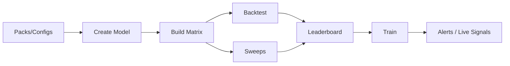

# Modeling Pipeline Guide (End‑to‑End)

This guide explains the core domain concepts (packs, models, policies, indicators, features, sweeps) and provides a practical, step‑by‑step workflow to build, backtest, sweep, train, and iterate toward profitable alerts using the Makefile pipeline and the Sigma Lab API.
 

## Core Concepts

- Pack: A productized strategy namespace under `packs/<pack_id>` containing:
  - model_configs/: YAML files per model (`<model_id>.yaml`) – ticker, horizon, cadence, feature flags, label config, etc.
  - indicator_sets/: YAML files listing indicators and params to compute during builds.
  - policy_templates/: YAML files describing execution policy (slippage, sizing, momentum gate, brackets, options selection).
  - model_templates/: Optional starter templates for new models (metadata + recommended settings).
- Model: A named configuration (e.g., `spy_opt_0dte_hourly`) that couples a ticker, horizon, cadence, features/labels and an execution policy for building, training, and evaluation.
- Policy (Execution): Controls how predictions translate to trades/alerts at runtime.
  - Effective fields (via `/policy/explain`):
    - slippage_bps: float (default 1.0)
    - size_by_conf: bool (default false)
    - conf_cap: float (default 1.0)
    - momentum_gate: bool (default false)
    - momentum_min: float (default 0.0)
    - momentum_column: str (default `momentum_score_total`)
    - brackets: enabled, mode, entry_mode, atr_period, atr_mult_stop, atr_mult_target, time_stop_minutes, min_rr, regime_adjust
    - options.selection: target_delta (0–1), dte_target (>0), min_oi (>=0), min_vol (~0–5), spread_width, weekly_ok
- Indicators: Computed signals and transforms (hundreds available) that feed feature sets.
  - List all via: `make indicators` or grouped: `make indicators-groups`.
  - Examples (from `sigma_core/indicators/builtins`): rsi_14, ema_20, atr_14, macd, momentum_score, iv_realized_spread, options_smile, bollinger, stoch_rsi, vix_term_slope, etc.
- Features: Selected columns used by the model (auto‑selected or driven by pack model config feature flags).
  - The training service builds features from the built matrix using `sigma_core.features.builder` and optional flags in `model_configs/<model_id>.yaml`.
- Build (Matrix): Fetches raw market/option data and computes indicators/features across the requested period. Output is a training matrix CSV.
- Backtest: Cross‑validated evaluation over historical data (splits + embargo) to quantify performance (Sharpe, cum_ret, trades, etc.).
- Leaderboard: Aggregated view of backtest runs stored in DB to quickly compare configurations across time.
- Train: Produces a deployable bundle (features + model + encoder) aligned with your build and policy.
- Sweeps: Batch exploration of threshold/hour/top‑pct variants to find strong parameter regimes quickly.

## Allowed Values (Most Common)

- Model naming: `<ticker>_<asset>_<horizon>_<cadence>[_variant]`
  - asset: `opt` | `eq`
  - horizon: commonly `0dte|intraday|swing|long`
  - cadence: `5m|15m|hourly|daily`
- Backtest params:
  - thresholds: CSV (e.g., `0.55,0.60,0.65`)
  - splits: int (e.g., `3|5`)
  - embargo: float (e.g., `0.0`)
  - allowed_hours: CSV of ints (e.g., `13,14,15`) or list
  - calibration: `none|sigmoid|isotonic`
  - momentum gate: bool + `momentum_min` and `momentum_column`
- Train params:
  - allowed_hours: CSV/list
  - calibration: `none|sigmoid|isotonic`
  - target: optional (defaults to `y` or `y_syn`)
- Sweep params (API):
  - thresholds_variants: list of CSV strings (e.g., `"0.50,0.52,0.54"`)
  - allowed_hours_variants: list of CSV hours (e.g., `"13,14,15"`)
  - top_pct_variants: list of floats (e.g., `0.10,0.15`)
  - guardrails: `min_trades`, `min_sharpe`

## Why Each Stage Matters

- Build: Establishes clean, reproducible features/labels; garbage‑in → garbage‑out.
- Backtest: Quantifies signal strength, stability, and sensitivity to parameters; prevents overfitting and premature deployment.
- Sweeps: Efficiently explores parameter grids to surface regimes with robust metrics.
- Leaderboard: Organizes past runs and makes it easy to track improvements and regressions.
- Train: Produces a deployable bundle (features + model + encoder) aligned with your build and policy.

## Step‑by‑Step: From Pack to Profitable Alerts

1) Discover Packs and Templates
- List packs: `make packs`
- Pack detail: `make pack-detail PACK_ID=zerosigma`
- Templates: `make pack-templates PACK_ID=zerosigma`
- Indicator sets: `make pack-indicators PACK_ID=zerosigma`
- Models in pack: `make pack-models PACK_ID=zerosigma` (or `make models`)

2) Create a Model
- Recommended: Choose clear IDs like `spy_opt_0dte_hourly`.
- Manual: `make init MODEL_ID=spy_opt_0dte_hourly TICKER=SPY PACK_ID=zerosigma`
- Auto: `make init-auto TICKER=SPY ASSET=opt HORIZON=0dte CADENCE=hourly PACK_ID=zerosigma`
- Inspect/edit configs under `packs/<PACK_ID>/model_configs/<MODEL_ID>.yaml` and policy under `packs/<PACK_ID>/policy_templates/<MODEL_ID>.yaml`.

3) Build the Dataset (Matrix)
- `make build MODEL_ID=spy_opt_0dte_hourly START=2024-01-01 END=2024-03-31 TICKER=SPY PACK_ID=zerosigma`
- Output CSV under `products/sigma-lab/matrices/<MODEL_ID>/training_matrix_built.csv`.
- DB: build_runs + artifacts recorded. History: `make runs-build PACK_ID=zerosigma MODEL_ID=spy_opt_0dte_hourly`.

4) Create a Sweep Config (Editable Grid)
- `make sweep-config MODEL_ID=spy_opt_0dte_hourly START=2024-01-01 END=2024-03-31`
- Edit `sweeps/<MODEL_ID>_sweep.yaml` to match your search space (thresholds, splits, hours, etc.).

5) Backtest to Quantify Performance
- Standard: `make backtest MODEL_ID=spy_opt_0dte_hourly THRESHOLDS=0.55,0.60,0.65 SPLITS=5`
- With momentum gate: `make backtest-gated ... MOMENTUM_MIN=0.1 MOMENTUM_COLUMN=momentum_score_total`
- DB: backtest_runs + backtest_folds + artifacts recorded.
- Leaderboard: `make leaderboard PACK_ID=zerosigma MODEL_ID=spy_opt_0dte_hourly`.

6) Train Baseline and Iterate
- `make train MODEL_ID=spy_opt_0dte_hourly ALLOWED_HOURS=13,14,15`
- DB: training_runs + artifacts recorded. History: `make runs-train ...`.
- Adjust features/policy and repeat build → backtest → train to improve Sharpe, hit rates, and robustness.

7) Explore Sweeps (Optional, Recommended)
- Use the sweep endpoint (client/HTTP) to run variants in batch.
- List sweeps: `make sweeps PACK_ID=zerosigma MODEL_ID=spy_opt_0dte_hourly`.
- Inspect one: `make sweep SWEEP_ID=123`.
- Adopt best regimes (hours/thresholds/top‑pct) and retrain.

8) Turn Signals into Alerts (Deployment Prep)
- A simple approach is to run your trained bundle on fresh data and write a `live_data/<model_id>/signals.csv`.
- If you maintain an alerts script, wire it to read the trained model bundle and current features, then write alerts (CSV or API).
- Ensure the policy’s execution parameters (brackets, sizing, momentum gate) are correct for your venue and risk profile.

## Practical Tips

- Start simple: 1 ticker, 1 cadence, clear horizon. Grow after baseline metrics are stable.
- Use sweeps to narrow ranges, then commit to a smaller set of production parameters.
- Watch for data quality: Use `/healthz` and matrix QA (NaN stats) to catch issues early.
- Policy matters: Momentum gate, brackets, and sizing often dominate realized PnL for directional strategies.
- Track everything in DB: build_runs, training_runs, backtest_runs, artifacts, and sweeps make audits and iteration faster.

## Reference: Useful Make Targets

- Packs: `packs`, `pack-detail`, `pack-templates`, `pack-indicators`, `pack-models`
- Models: `init`, `init-auto`, `models`
- Build: `build`, history: `runs-build`
- Backtest: `backtest`, `backtest-gated`, summary: `leaderboard`
- Train: `train`, history: `runs-train`
- Sweeps: `sweeps`, `sweep`; config: `sweep-config`
- Smoke: `check-backend`

## Troubleshooting

- Migrations: `make db-migrate` (reads .env). If password errors, set `DB_*` or `DATABASE_URL` correctly.
- Health: `make health TICKER=SPY` – checks Polygon/data/DB readiness.
- Slow builds: reduce date range or adjust indicator set; ensure API keys and quotas are valid.
- Empty leaderboards: ensure you completed a backtest and DB envs are set; recheck `/leaderboard`.

*** End of Guide ***
