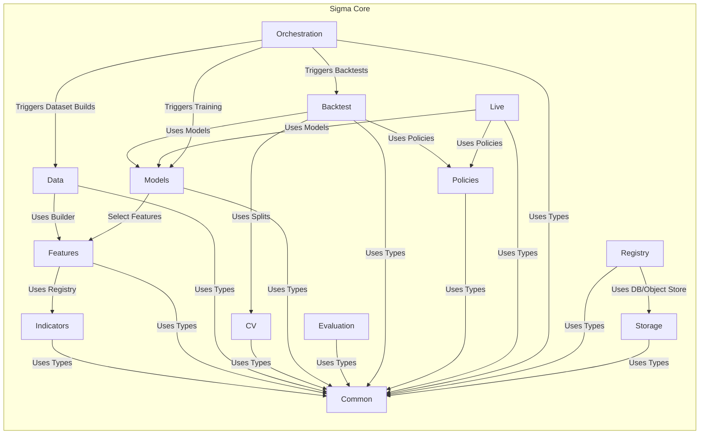

# Architecture

This page presents the high-level system architecture and the Sigma Core module relationships in Mermaid format for inline rendering on the wiki.

## System Overview

```mermaid
graph LR
  %% Nodes
  User((User))
  EDP[External Data Providers]
  DB[(PostgreSQL DB)]
  OS[(Object Storage (S3/MinIO))]

  subgraph Sigmatiq_Sigma_Platform[Sigmatiq Sigma Platform]
    UI["Sigma UI"]
    API["Sigma API"]
    Workers["Sigma Workers"]
    Core["Sigma Core"]
  end

  %% Interactions
  User --> UI
  UI --> API
  API --> Core
  Workers --> Core
  Core --> DB
  Core --> OS
  EDP --> Core
  API --> DB
  API --> OS
  Workers --> DB
  Workers --> OS
```

## Sigma Core Modules



Source PlantUML: see `docs/design_diagrams.puml` in the repository.

