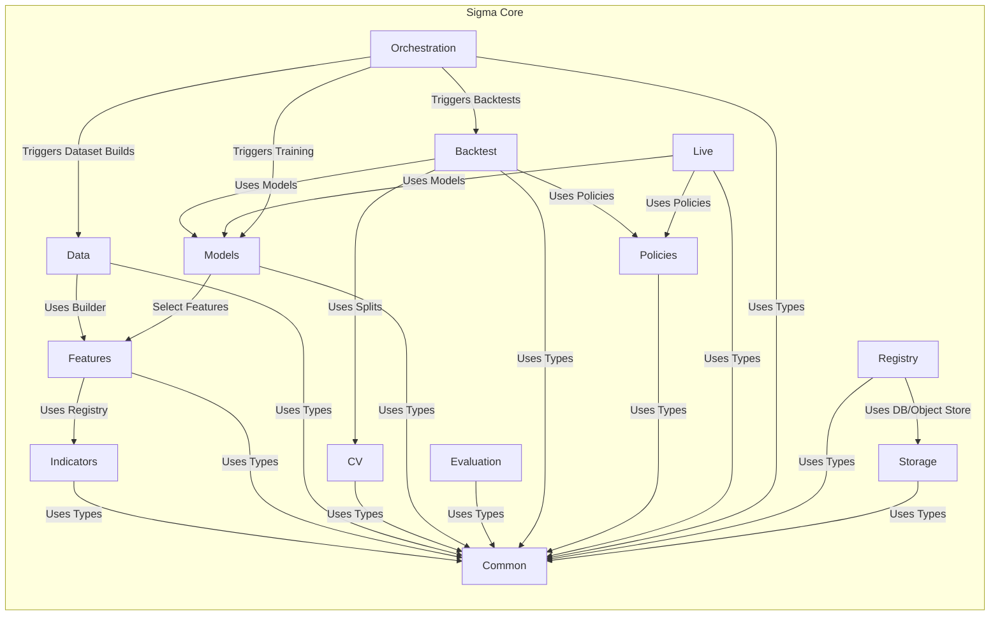

# Sigmatiq - Project Documentation

## 1. Overview

Sigmatiq is an institutional-grade trading platform designed for retail investors, providing the complete lifecycle from strategy discovery to automated execution. The platform features model authoring, comprehensive backtesting, paper trading simulation, and automated execution with enterprise-level risk controls.

### Core Philosophy

- **Evidence over opinion** - All signals carry provenance, assumptions, and expected ranges
- **Transparency first** - Model cards, data sheets, and post-trade attribution are standard
- **Risk-aware by default** - Conservative controls enabled by default; users must opt into higher risk
- **Human control** - Automation is reversible and bounded by user policies
- **Continuous learning** - Every trade feeds evaluation loops and improves models

## 2. Architecture

The Sigmatiq platform is composed of several key components that work together to provide a seamless trading experience.

```mermaid
graph LR
  %% Nodes
  User((User))
  EDP[External Data Providers]
  DB[(PostgreSQL DB)]
  OS[(Object Storage (S3/MinIO))]

  subgraph Sigmatiq_Sigma_Platform[Sigmatiq Sigma Platform]
    UI["Sigma UI"]
    API["Sigma API"]
    Workers["Sigma Workers"]
    Core["Sigma Core"]
  end

  %% Interactions
  User --> UI
  UI --> API
  API --> Core
  Workers --> Core
  Core --> DB
  Core --> OS
  EDP --> Core
  API --> DB
  API --> OS
  Workers --> DB
  Workers --> OS
```

### Sigma Core Modules

The `sigma-core` module is the heart of the platform, providing the core functionalities for data processing, feature engineering, modeling, and backtesting.



## 3. Repository Structure

The platform is structured as a monorepo with modular components that will eventually be migrated to separate repositories.

```
sigmatiq/
├── .github/
├── branding/
├── docs/
├── products/
│   ├── sigma-core/
│   ├── sigma-lab/
│   ├── sigma-market/
│   ├── sigma-pilot/
│   ├── sigma-platform/
│   ├── sigma-sim/
│   └── sigma-workers/
├── scripts/
├── .env.example
├── .gitignore
├── CLAUDE.md
├── Makefile
├── README.md
└── requirements.txt
```

### Key Files

*   **`README.md`**: High-level overview of the project, its philosophy, architecture, and setup instructions.
*   **`CLAUDE.md`**: A comprehensive development guide for the "Sigmatiq Sigma Lab" product, including detailed information about the architecture, UI/UX, trading strategies, and development workflow.
*   **`Makefile`**: Contains a wide range of commands for building, testing, running, and interacting with the various components of the platform.
*   **`requirements.txt`**: Lists the Python dependencies for the backend services.

## 4. Products

The `products` directory contains the different components of the Sigmatiq platform.

### 4.1. Sigma Lab (`products/sigma-lab`)

The core product for model authoring, training, and evaluation.

*   **API (`api/`)**: A FastAPI backend providing a REST API for all Sigma Lab functionalities.
    *   **Structure**: The API is well-structured with separate directories for routers, services, infrastructure, and tests.
    *   **Routers**: The `routers` directory contains a file for each major API endpoint, such as `models.py`, `backtest.py`, and `leaderboard.py`.
*   **UI (`ui/`)**: A React and TypeScript frontend for interacting with the Sigma Lab API.
    *   **Structure**: The UI follows best practices with separate directories for components, pages, services, and styles.
    *   **Technologies**: The UI is built with Vite, uses React Context for state management, and has a strong focus on theming and accessibility.
*   **Other Directories**: `artifacts`, `data`, `matrices`, `mock-api`, `packs`, `reports`, and `static` support the core functionalities of Sigma Lab.

### 4.2. Other Products

*   **`sigma-core`**: Shared libraries and core functionalities.
*   **`sigma-market`**: Strategy marketplace.
*   **`sigma-pilot`**: Automated execution engine.
*   **`sigma-platform`**: Platform-level helpers and services.
*   **`sigma-sim`**: Paper trading simulation environment.
*   **`sigma-workers`**: Asynchronous task workers.

## 5. Technology Stack

### Backend

*   **Python 3.10+**
*   **FastAPI**: REST API framework
*   **Uvicorn**: ASGI server
*   **PostgreSQL**: Primary database
*   **SQLAlchemy**: ORM (optional)
*   **Pydantic**: Data validation
*   **Pandas**, **NumPy**, **scikit-learn**, **XGBoost**: Data analysis and machine learning
*   **Polygon.io**: Market data provider

### Frontend

*   **React 18** with **TypeScript**
*   **Vite**: Build tool
*   **CSS-in-JS**: with semantic design tokens
*   **React Context**: State management

### Infrastructure

*   **Docker**: for containerization
*   **Make**: for task automation

## 6. Development

### Getting Started

1.  Clone the repository.
2.  Install Python and Node.js dependencies.
3.  Set up the environment variables in a `.env` file (based on `.env.example`).
4.  Use the `Makefile` to run the various components of the platform.

### Key `make` Commands

*   `make help`: Show a list of all available commands.
*   `make lab-dev`: Start the mock API and the UI for local development.
*   `make check-backend`: Run a smoke test against the real API.
*   `make test-indicators`: Run a live indicator test script.
*   `make db-migrate`: Apply database migrations.
*   `make docs-preview`: Serve the documentation locally.

## 7. Documentation

The `docs/` directory contains comprehensive documentation for the platform.

### Key Documentation Files

*   **`START_HERE.md`**: A curated quick-start guide for non-technical users.
*   **`index.md`**: The main entry point for the documentation, with links to all other documents.
*   **`architecture.md`**: High-level system architecture diagrams.
*   **`conventions.md`**: Coding conventions and standards.
*   **`MAKEFILE_GUIDE.md`**: A guide to the `Makefile` commands.
*   **`MODELING_PIPELINE_GUIDE.md`**: A guide to the modeling pipeline.
*   **`INDICATORS_REFERENCE.md`**: A reference for all the indicators available in the platform.

The `Makefile` provides a command `make docs-preview` to serve the documentation locally.

## 8. Contributing

This is currently a private repository. For partnership inquiries or to report issues, please contact the development team.

### Development Guidelines

- Follow PEP 8 for Python code
- Use TypeScript strict mode for frontend
- Write tests for new features
- Update documentation for API changes
- Use semantic commit messages
