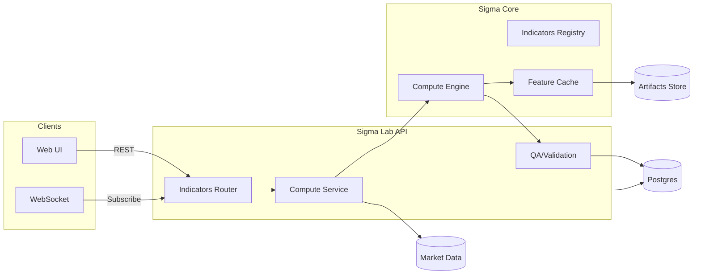

# System Architecture — Single Indicator

Notes
- Focuses on computing a single indicator per request or stream; combinations are out of scope.
- Registry validates params and exposes compute callable and metadata.
- Engine performs vectorized calculation and incremental updates; cache deduplicates repeated requests.
- QA runs basic checks (NaN, alignment) and returns warnings.
