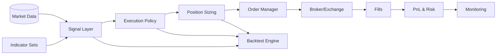

# Strategy Architecture

Components
- Signal Layer: transforms indicator-set outputs into entry/exit events (rules or ML).
- Execution Policy: slippage, brackets (ATR/time), momentum gates, hours, liquidity rules.
- Position Sizing: fixed-fractional, volatility targeting, Kelly cap, max exposure/heat.
- Order Manager: child orders (limit/market), time-in-force, partial fills, retries.
- Risk Engine: drawdown monitors, exposure caps, circuit breakers, compliance rules.
- Backtest Engine: event-driven or vectorized sim with TX costs, splits, embargo.
- Monitoring: metrics, alerts, dashboards, logs, audit lineage.

State & Lineage
- Persist strategy config, policy version, indicator-set version, and git sha.
- Store run history: trades, orders, fills, PnL, and artifacts (plots/reports).

