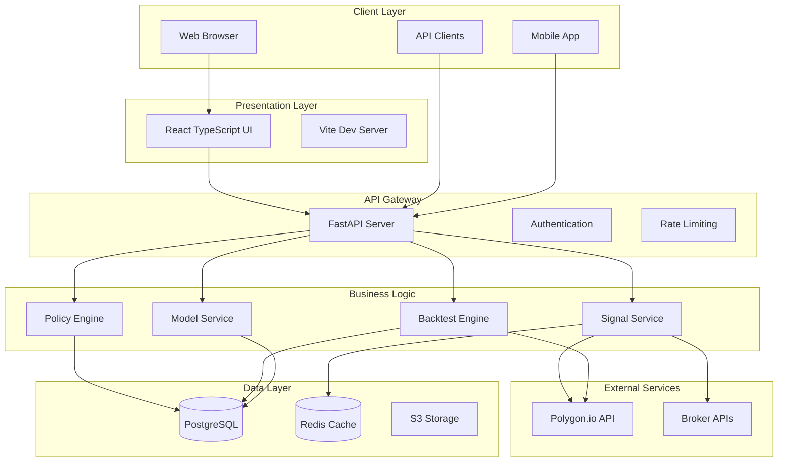
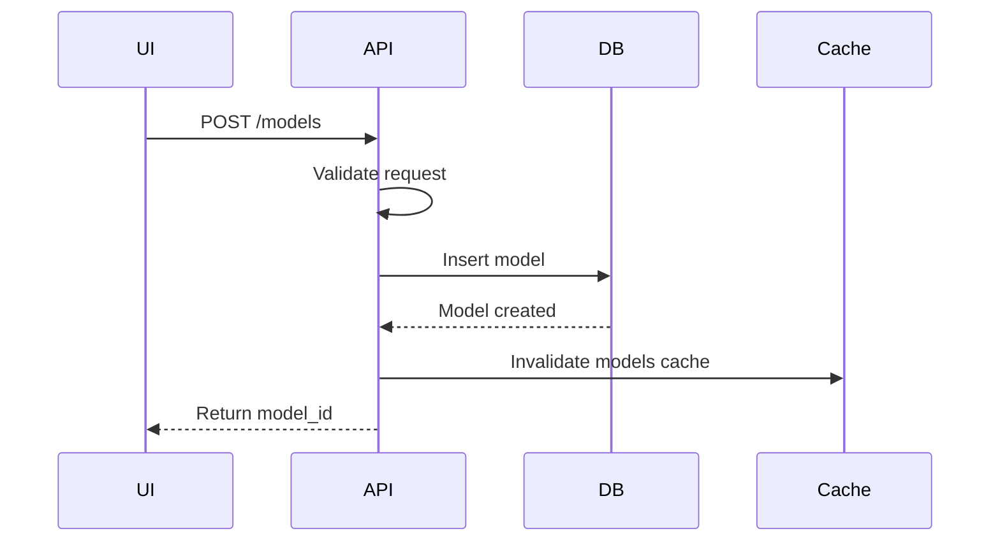
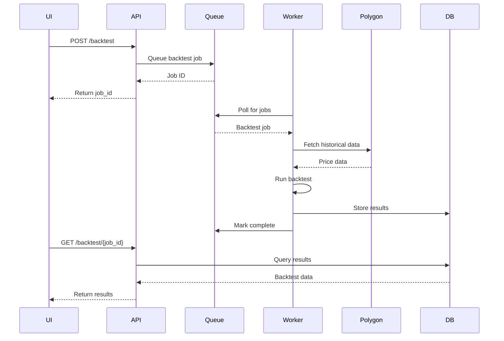
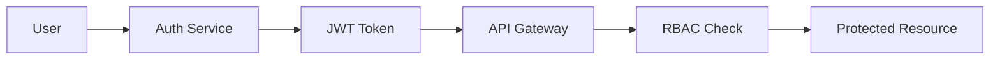
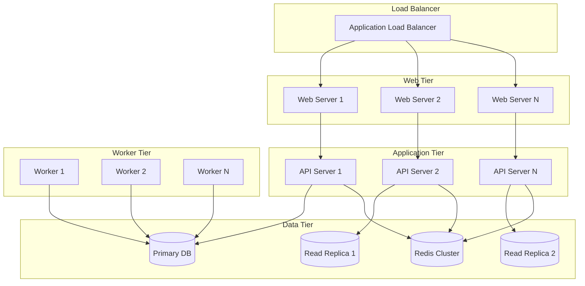
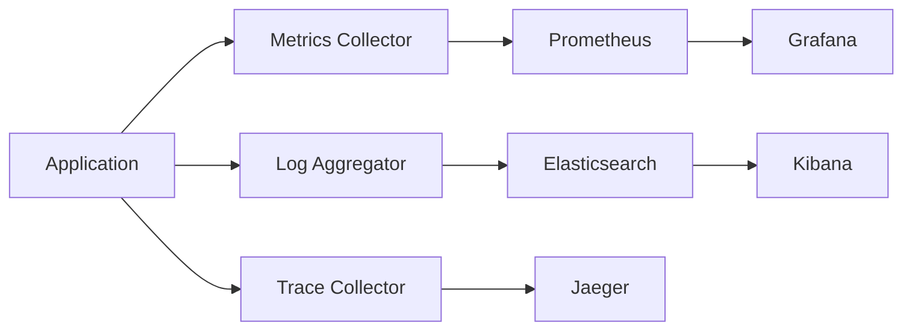

# System Architecture

## Overview

Sigmatiq Sigma Lab follows a modern microservices architecture with clear separation of concerns, enabling scalability, maintainability, and rapid feature development.

## 🏗️ High-Level Architecture



## 📁 Project Structure

```
sigmatiq/
├── products/
│   ├── sigma-lab/              # Main application
│   │   ├── api/                # FastAPI backend
│   │   │   ├── endpoints/      # API route handlers
│   │   │   ├── services/       # Business logic
│   │   │   ├── models/         # Pydantic models
│   │   │   └── migrations/     # Database migrations
│   │   ├── ui/                 # React frontend
│   │   │   ├── src/
│   │   │   │   ├── components/ # React components
│   │   │   │   ├── pages/      # Page components
│   │   │   │   ├── services/   # API clients
│   │   │   │   └── styles/     # CSS/styling
│   │   │   └── public/         # Static assets
│   │   ├── packs/             # Trading strategy packs
│   │   ├── matrices/          # Training matrices
│   │   └── artifacts/         # Model artifacts
│   ├── sigma-core/            # Shared libraries
│   │   ├── indicators/        # Technical indicators
│   │   ├── utils/            # Utilities
│   │   └── tests/            # Core tests
│   └── sigma-platform/        # Platform services
│       ├── auth/             # Authentication
│       ├── monitoring/       # Observability
│       └── integration/      # External integrations
├── docs/                      # Documentation
├── tests/                     # Integration tests
└── scripts/                   # Deployment scripts
```

## 🔧 Core Components

### Frontend (React TypeScript)

#### Technology Stack
- **Framework**: React 18 with TypeScript
- **Build Tool**: Vite for fast HMR and optimized builds
- **Routing**: React Router v6
- **State Management**: React Context + Custom Hooks
- **Styling**: CSS-in-JS with semantic design tokens
- **API Client**: Type-safe Axios wrapper

#### Key Features
- Server-side rendering ready
- Code splitting by route
- Progressive Web App capabilities
- Accessibility (WCAG AA compliant)
- Responsive design (mobile-first)

### Backend (FastAPI)

#### Technology Stack
- **Framework**: FastAPI with async support
- **Validation**: Pydantic models
- **Database ORM**: SQLAlchemy
- **Task Queue**: Celery with Redis
- **Caching**: Redis with TTL strategies
- **Documentation**: Auto-generated OpenAPI/Swagger

#### API Design Principles
- RESTful architecture
- Consistent error handling
- Request/response validation
- Rate limiting per endpoint
- API versioning support

### Database Layer

#### PostgreSQL Schema

```sql
-- Core Tables
models
├── model_id (PK)
├── pack_id
├── user_id
├── config (JSONB)
├── created_at
└── updated_at

backtests
├── id (PK)
├── model_id (FK)
├── matrix_sha
├── config (JSONB)
├── metrics (JSONB)
├── created_at
└── status

signals
├── id (PK)
├── model_id (FK)
├── ticker
├── action
├── price
├── timestamp
└── status

-- Relationships
models ──┐
         ├── backtests
         └── signals
```

#### Data Partitioning
- Time-series data partitioned by month
- Separate read replicas for analytics
- Connection pooling for high concurrency

### Caching Strategy

#### Redis Cache Layers

1. **API Response Cache**
   - TTL: 5 minutes for dynamic data
   - TTL: 1 hour for reference data
   - Invalidation on updates

2. **Historical Data Cache**
   - Never cache today's data
   - Permanent cache for historical prices
   - LRU eviction policy

3. **Session Cache**
   - User sessions and preferences
   - 24-hour TTL with sliding expiration

## 🔄 Data Flow

### Model Creation Flow



### Backtest Execution Flow



## 🔐 Security Architecture

### Authentication & Authorization



### Security Layers

1. **Network Security**
   - HTTPS everywhere
   - Rate limiting
   - DDoS protection
   - IP whitelisting for admin

2. **Application Security**
   - Input validation
   - SQL injection prevention
   - XSS protection
   - CSRF tokens

3. **Data Security**
   - Encryption at rest
   - Encryption in transit
   - PII data masking
   - Audit logging

## 🚀 Deployment Architecture

### Production Environment



### Container Strategy

```yaml
# Docker Compose Structure
services:
  frontend:
    build: ./products/sigma-lab/ui
    ports:
      - "3000:3000"
  
  backend:
    build: ./products/sigma-lab/api
    ports:
      - "8001:8001"
    depends_on:
      - postgres
      - redis
  
  postgres:
    image: postgres:14
    volumes:
      - postgres_data:/var/lib/postgresql/data
  
  redis:
    image: redis:7-alpine
    volumes:
      - redis_data:/data
  
  worker:
    build: ./products/sigma-lab/api
    command: celery worker
    depends_on:
      - postgres
      - redis
```

## 📊 Monitoring & Observability

### Metrics Collection



### Key Metrics

1. **Application Metrics**
   - Request rate
   - Response time (p50, p95, p99)
   - Error rate
   - Active users

2. **Business Metrics**
   - Models created
   - Backtests executed
   - Signals generated
   - Success rate

3. **Infrastructure Metrics**
   - CPU utilization
   - Memory usage
   - Disk I/O
   - Network throughput

## 🔄 Scaling Considerations

### Horizontal Scaling

- **Stateless API servers**: Easy to scale horizontally
- **Read replicas**: Distribute read load
- **Cache clustering**: Redis cluster for high availability
- **Queue workers**: Scale based on job queue depth

### Vertical Scaling

- **Database**: Upgrade instance types for complex queries
- **Worker nodes**: More CPU/RAM for compute-intensive backtests
- **Cache nodes**: More memory for larger datasets

### Performance Optimization

1. **Database**
   - Proper indexing strategy
   - Query optimization
   - Connection pooling
   - Materialized views for analytics

2. **Caching**
   - Multi-tier caching
   - Cache warming strategies
   - Intelligent invalidation

3. **Frontend**
   - Code splitting
   - Lazy loading
   - Image optimization
   - CDN distribution

## 🔌 Integration Points

### External Services

| Service | Purpose | Protocol | Authentication |
|---------|---------|----------|----------------|
| Polygon.io | Market data | REST API | API Key |
| AWS S3 | File storage | REST API | IAM Role |
| SendGrid | Email notifications | REST API | API Key |
| Stripe | Payments | REST API | OAuth 2.0 |
| Broker APIs | Trade execution | REST/WebSocket | OAuth 2.0 |

### Webhook System

```python
# Webhook payload structure
{
    "event": "backtest.completed",
    "timestamp": "2024-01-01T00:00:00Z",
    "data": {
        "model_id": "xxx",
        "backtest_id": "yyy",
        "status": "success",
        "metrics": {...}
    }
}
```

## 🎯 Design Patterns

### Applied Patterns

1. **Repository Pattern**: Data access abstraction
2. **Service Layer**: Business logic encapsulation
3. **Factory Pattern**: Model/strategy creation
4. **Observer Pattern**: Event-driven updates
5. **Circuit Breaker**: External service resilience
6. **Retry Pattern**: Transient failure handling

### Code Organization

```python
# Service layer example
class ModelService:
    def __init__(self, repository: ModelRepository):
        self.repository = repository
    
    async def create_model(self, data: ModelCreate) -> Model:
        # Business logic
        model = await self.repository.create(data)
        await self.publish_event("model.created", model)
        return model
```

## 📚 Technology Decisions (ADRs)

### ADR-001: FastAPI for Backend
**Decision**: Use FastAPI instead of Django/Flask
**Reasons**:
- Native async support
- Automatic API documentation
- Type hints and validation
- High performance

### ADR-002: PostgreSQL for Primary Database
**Decision**: Use PostgreSQL over NoSQL
**Reasons**:
- ACID compliance for financial data
- Complex query support
- JSONB for flexible schemas
- Mature ecosystem

### ADR-003: React with TypeScript
**Decision**: React + TypeScript for frontend
**Reasons**:
- Type safety
- Large ecosystem
- Component reusability
- Strong community support

---

**Next**: Learn about the [BTB Pipeline](BTB-Pipeline) or explore [Trading Packs](Trading-Packs)