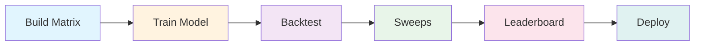
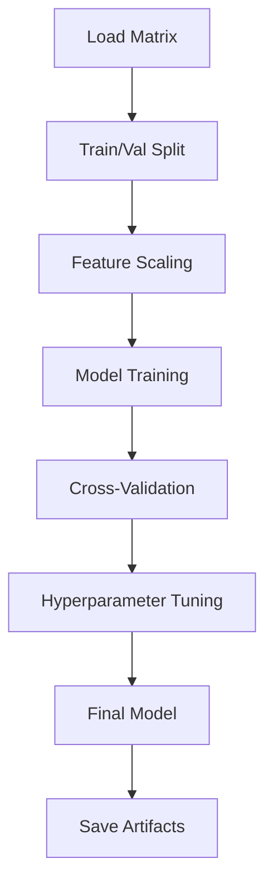
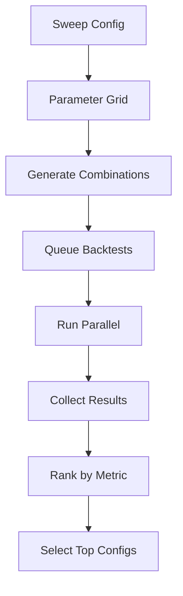
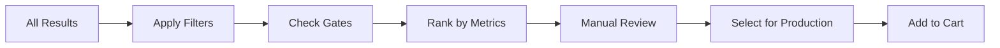

# Build-Train-Backtest (BTB) Pipeline

The BTB Pipeline is the core workflow for developing, training, and validating trading models in Sigmatiq Sigma Lab.

## 🔄 Pipeline Overview



## 📊 Phase 1: Build Matrix

The Build phase creates training matrices from historical market data combined with technical indicators.

### What is a Training Matrix?

A training matrix is a structured dataset containing:
- Historical price data (OHLCV)
- Technical indicators
- Market microstructure data
- Calculated features
- Target variables

### Matrix Construction Process

```python
# Example matrix building configuration
build_config = {
    "ticker": "AAPL",
    "start_date": "2023-01-01",
    "end_date": "2023-12-31",
    "features": {
        "price_data": ["open", "high", "low", "close", "volume"],
        "indicators": ["RSI_14", "MACD", "BB_20", "ATR_14"],
        "custom": ["price_momentum", "volume_profile"]
    },
    "target": "next_day_return",
    "frequency": "1D"
}
```

### Matrix Structure

| Timestamp | Open | High | Low | Close | Volume | RSI_14 | MACD | Target |
|-----------|------|------|-----|-------|--------|--------|------|--------|
| 2023-01-02 | 150.0 | 152.5 | 149.5 | 151.0 | 10M | 45.2 | 0.5 | 0.015 |
| 2023-01-03 | 151.0 | 153.0 | 150.5 | 152.5 | 12M | 48.7 | 0.8 | -0.008 |

### Matrix Generation Steps

1. **Data Collection**
   ```python
   # Fetch historical data
   data = polygon_client.get_bars(
       ticker="AAPL",
       timespan="day",
       from_="2023-01-01",
       to="2023-12-31"
   )
   ```

2. **Feature Engineering**
   ```python
   # Calculate technical indicators
   df['RSI'] = ta.RSI(df['close'], timeperiod=14)
   df['MACD'], df['MACD_signal'], _ = ta.MACD(df['close'])
   df['BB_upper'], df['BB_middle'], df['BB_lower'] = ta.BBANDS(df['close'])
   ```

3. **Target Creation**
   ```python
   # Define prediction target
   df['target'] = df['close'].pct_change().shift(-1)  # Next day return
   ```

4. **Matrix Validation**
   - Check for missing data
   - Verify indicator calculations
   - Ensure temporal consistency
   - Remove lookahead bias

### Matrix Storage

Matrices are stored with unique SHA identifiers:
```
matrices/
├── AAPL_equity_5d_daily_7f8a9b2c.parquet
├── TSLA_options_0d_1min_3d4e5f6g.parquet
└── metadata/
    ├── 7f8a9b2c.json  # Matrix configuration
    └── 3d4e5f6g.json
```

## 🧠 Phase 2: Train Model

The Train phase uses the built matrix to train machine learning models.

### Training Algorithms

#### Available Models

1. **Linear Models**
   - Ridge Regression
   - Lasso Regression
   - Elastic Net

2. **Tree-Based Models**
   - Random Forest
   - XGBoost
   - LightGBM
   - CatBoost

3. **Neural Networks**
   - LSTM (for time series)
   - GRU
   - Transformer-based models

4. **Ensemble Methods**
   - Voting Classifier
   - Stacking
   - Blending

### Training Configuration

```python
train_config = {
    "model_type": "xgboost",
    "parameters": {
        "n_estimators": 100,
        "max_depth": 6,
        "learning_rate": 0.01,
        "subsample": 0.8
    },
    "validation": {
        "method": "time_series_split",
        "n_splits": 5,
        "gap": 1  # Days between train and test
    },
    "allowed_hours": [9, 10, 11, 12, 13, 14, 15],
    "features_to_use": ["RSI", "MACD", "volume_ratio"]
}
```

### Training Process



### Model Artifacts

After training, the following artifacts are saved:
```
artifacts/
├── models/
│   ├── model_7f8a9b2c.pkl      # Trained model
│   ├── scaler_7f8a9b2c.pkl     # Feature scaler
│   └── config_7f8a9b2c.json    # Training config
├── metrics/
│   ├── validation_7f8a9b2c.json # Validation metrics
│   └── feature_importance.csv   # Feature rankings
└── plots/
    ├── learning_curve.png
    └── feature_importance.png
```

### Training Best Practices

1. **Prevent Overfitting**
   - Use cross-validation
   - Apply regularization
   - Monitor validation metrics
   - Early stopping

2. **Feature Selection**
   - Remove highly correlated features
   - Use feature importance scores
   - Apply domain knowledge
   - Test feature stability

3. **Data Preprocessing**
   - Normalize/standardize features
   - Handle missing values
   - Remove outliers carefully
   - Maintain temporal order

## 📈 Phase 3: Backtest

The Backtest phase simulates trading using historical data to evaluate model performance.

### Backtest Configuration

```python
backtest_config = {
    "start_date": "2023-06-01",
    "end_date": "2023-12-31",
    "initial_capital": 100000,
    "position_sizing": {
        "method": "fixed_fraction",
        "fraction": 0.02  # 2% per trade
    },
    "execution": {
        "slippage": 0.001,  # 0.1% slippage
        "commission": 0.001,  # 0.1% commission
        "market_impact": "linear"
    },
    "risk_management": {
        "stop_loss": 0.05,  # 5% stop loss
        "take_profit": 0.10,  # 10% take profit
        "max_positions": 5,
        "max_drawdown": 0.20  # 20% max drawdown
    }
}
```

### Backtest Engine

The backtest engine simulates realistic trading conditions:

```python
class BacktestEngine:
    def run(self, model, data, config):
        portfolio = Portfolio(config.initial_capital)
        
        for timestamp, row in data.iterrows():
            # Get model prediction
            signal = model.predict(row.features)
            
            # Generate orders
            if signal > config.entry_threshold:
                order = BuyOrder(
                    ticker=row.ticker,
                    quantity=calculate_position_size(),
                    price=row.close
                )
            elif signal < config.exit_threshold:
                order = SellOrder(...)
            
            # Execute with realistic constraints
            fill = execute_order(order, slippage, commission)
            portfolio.update(fill)
            
            # Risk management
            check_stop_loss(portfolio)
            check_position_limits(portfolio)
        
        return portfolio.get_metrics()
```

### Performance Metrics

#### Core Metrics

| Metric | Description | Target |
|--------|-------------|--------|
| **Sharpe Ratio** | Risk-adjusted returns | > 1.5 |
| **Cumulative Return** | Total return over period | > 20% annual |
| **Max Drawdown** | Largest peak-to-trough decline | < 15% |
| **Win Rate** | Percentage of profitable trades | > 55% |
| **Profit Factor** | Gross profit / Gross loss | > 1.5 |

#### Advanced Metrics

- **Sortino Ratio**: Downside risk-adjusted returns
- **Calmar Ratio**: Return / Max Drawdown
- **Information Ratio**: Active return / Tracking error
- **Beta**: Market correlation
- **Alpha**: Excess returns

### Backtest Visualization

Generated plots include:
- Equity curve
- Drawdown chart
- Returns distribution
- Trade analysis
- Monthly returns heatmap

## 🎯 Phase 4: Sweeps

Sweeps run multiple backtests with different parameter combinations to find optimal configurations.

### Sweep Configuration

```python
sweep_config = {
    "model_id": "AAPL_equity_5d_daily",
    "parameter_grid": {
        "entry_threshold": [0.5, 0.6, 0.7, 0.8],
        "exit_threshold": [-0.5, -0.3, -0.1],
        "stop_loss": [0.03, 0.05, 0.08],
        "position_size": [0.01, 0.02, 0.03],
        "allowed_hours": [
            [9, 10, 11],
            [12, 13, 14, 15],
            [9, 10, 11, 12, 13, 14, 15]
        ]
    },
    "optimization_metric": "sharpe_ratio",
    "risk_profile": "Balanced"
}
```

### Sweep Execution



### Sweep Results

Results are organized in a structured format:

| Config ID | Entry | Exit | Stop | Sharpe | Return | Drawdown | Gate |
|-----------|-------|------|------|--------|--------|----------|------|
| cfg_001 | 0.7 | -0.3 | 0.05 | 2.1 | 35% | -8% | ✅ Pass |
| cfg_002 | 0.6 | -0.1 | 0.03 | 1.8 | 28% | -12% | ✅ Pass |
| cfg_003 | 0.8 | -0.5 | 0.08 | 1.2 | 22% | -18% | ❌ Fail |

### Optimization Strategies

1. **Grid Search**: Test all combinations
2. **Random Search**: Sample random combinations
3. **Bayesian Optimization**: Smart parameter exploration
4. **Genetic Algorithms**: Evolutionary optimization

## 🏆 Phase 5: Leaderboard

The Leaderboard ranks and compares all backtest results for selection.

### Leaderboard Features

#### Ranking Criteria
- Primary: Sharpe Ratio
- Secondary: Total Return
- Tertiary: Max Drawdown

#### Filtering Options
- Risk profile (Conservative/Balanced/Aggressive)
- Gate status (Pass/Fail only)
- Time period
- Pack type
- Minimum trades

### Gate System

Gates are risk checks that must pass for production deployment:

```python
gates = {
    "sharpe_gate": sharpe_ratio > 1.0,
    "drawdown_gate": max_drawdown < 0.20,
    "trades_gate": num_trades > 50,
    "win_rate_gate": win_rate > 0.45,
    "profit_factor_gate": profit_factor > 1.2
}
```

#### Gate Failure Reasons

Common gate failures and solutions:

| Gate | Failure Reason | Solution |
|------|---------------|----------|
| Sharpe | Low risk-adjusted returns | Tighten entry criteria |
| Drawdown | Excessive losses | Add stop-loss rules |
| Trades | Insufficient samples | Extend backtest period |
| Win Rate | Low accuracy | Improve model features |

### Selection Process



## 🚀 Deployment

After selection from the leaderboard, models are deployed to production.

### Deployment Steps

1. **Final Validation**
   ```python
   # Run final checks
   validate_model_artifacts(model_id)
   verify_data_pipeline(model_id)
   test_execution_path(model_id)
   ```

2. **Configuration Lock**
   ```python
   # Lock configuration
   production_config = {
       "model_id": selected_model_id,
       "config_sha": config_sha,
       "matrix_sha": matrix_sha,
       "deployed_at": timestamp,
       "risk_limits": {...}
   }
   ```

3. **Monitoring Setup**
   - Real-time performance tracking
   - Deviation alerts
   - Risk limit monitoring
   - Execution quality metrics

## 📊 Pipeline Automation

### Automated Workflows

```yaml
# .github/workflows/btb-pipeline.yml
name: BTB Pipeline

on:
  schedule:
    - cron: '0 2 * * *'  # Daily at 2 AM

jobs:
  build:
    runs-on: ubuntu-latest
    steps:
      - name: Build Matrix
        run: sigma-cli build --ticker $TICKER
      
      - name: Train Model
        run: sigma-cli train --matrix latest
      
      - name: Run Sweeps
        run: sigma-cli sweep --config sweep.yaml
      
      - name: Update Leaderboard
        run: sigma-cli leaderboard update
      
      - name: Notify Results
        run: sigma-cli notify --channel slack
```

### CLI Commands

```bash
# Full pipeline execution
sigma-cli pipeline run --ticker AAPL --pack swingsigma

# Individual phases
sigma-cli build --ticker AAPL --start 2023-01-01 --end 2023-12-31
sigma-cli train --matrix 7f8a9b2c --model xgboost
sigma-cli backtest --model model_123 --config backtest.yaml
sigma-cli sweep --model model_123 --grid sweep_grid.yaml
sigma-cli leaderboard show --filter "gate:pass,sharpe:>1.5"

# Pipeline status
sigma-cli pipeline status --job job_123
sigma-cli pipeline logs --job job_123
```

## 🔍 Best Practices

### Data Quality
- Verify data completeness
- Check for survivorship bias
- Handle corporate actions
- Adjust for splits/dividends

### Model Development
- Start simple, add complexity gradually
- Use walk-forward analysis
- Test on out-of-sample data
- Monitor for regime changes

### Risk Management
- Never disable risk gates
- Use conservative position sizing
- Diversify across strategies
- Regular performance review

### Performance Optimization
- Cache computed features
- Parallelize backtests
- Use incremental training
- Optimize database queries

## 📚 Advanced Topics

### Custom Indicators

Create custom indicators for the pipeline:

```python
@register_indicator
def custom_momentum(prices, period=20):
    """Custom momentum indicator"""
    returns = prices.pct_change(period)
    volatility = returns.rolling(period).std()
    return returns / volatility  # Vol-adjusted momentum
```

### Feature Engineering

Advanced feature creation:

```python
def create_features(df):
    # Price-based features
    df['log_return'] = np.log(df['close'] / df['close'].shift(1))
    df['price_acceleration'] = df['close'].diff().diff()
    
    # Volume features
    df['volume_ratio'] = df['volume'] / df['volume'].rolling(20).mean()
    df['dollar_volume'] = df['close'] * df['volume']
    
    # Microstructure features
    df['spread'] = (df['ask'] - df['bid']) / df['mid']
    df['order_imbalance'] = (df['buy_volume'] - df['sell_volume']) / df['volume']
    
    return df
```

### Pipeline Monitoring

Track pipeline health metrics:

```python
pipeline_metrics = {
    "build_duration": 120,  # seconds
    "train_accuracy": 0.72,
    "backtest_sharpe": 1.85,
    "sweep_combinations": 144,
    "gate_pass_rate": 0.35,
    "deployment_success": True
}
```

---

**Next Steps**: Review the [Development Guide](Development-Guide) or explore [API Reference](API-Reference)