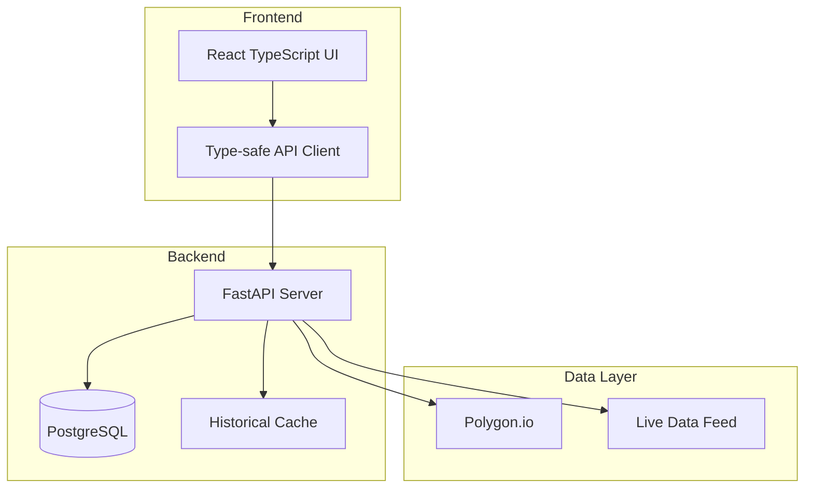

# Welcome to Sigmatiq Sigma Lab Wiki

## 🚀 Institutional-Grade Trading Platform for Retail Investors

Sigmatiq Sigma Lab provides the complete trading lifecycle: **Discover → Validate → Simulate → Subscribe → Automate → Review**

### 🎯 Core Products

| Product | Description | Status |
|---------|-------------|--------|
| **Sigma Lab** | Model authoring and evaluation platform | ✅ Active |
| **Sigma Sim** | Broker-aware paper trading validation | 🚧 Development |
| **Sigma Market** | Curated signal feeds marketplace | 📋 Planned |
| **Sigma Pilot** | Policy-driven execution automation | 📋 Planned |

### 🏗️ Platform Architecture

### 📚 Quick Links

#### Getting Started
- [🚀 Installation Guide](Getting-Started)
- [📖 First Model Tutorial](Getting-Started#your-first-model)
- [⚙️ Configuration](Getting-Started#configuration)

#### Core Concepts
- [🏛️ Architecture Overview](Architecture)
- [📊 BTB Pipeline](BTB-Pipeline)
- [📦 Trading Packs](Trading-Packs)

#### Development
- [💻 Development Guide](Development-Guide)
- [🔌 API Reference](API-Reference)
- [🎨 UI Components](UI-Components)

#### Operations
- [🚢 Deployment](Deployment)
- [📊 Monitoring](Monitoring)
- [🔒 Security](Security)

### 🎯 Key Features

#### Build-Train-Backtest (BTB) Pipeline
The heart of Sigma Lab - a comprehensive pipeline for model development:

1. **Build** - Construct training matrices from historical data
2. **Train** - Train models with configurable parameters
3. **Backtest** - Validate performance across multiple configurations
4. **Sweeps** - Grid search for optimal parameters
5. **Leaderboard** - Compare and select best performers

#### Trading Strategy Packs

| Pack | Horizon | Description |
|------|---------|-------------|
| **ZeroSigma** | 0DTE | Same-day options expiry strategies |
| **SwingSigma** | 2-10 days | Swing trading positions |
| **LongSigma** | 63-252 days | Long-term investment strategies |
| **OvernightSigma** | 1 day | Gap trading strategies |
| **MomentumSigma** | Variable | Volatility-scaled momentum |

### 🛠️ Technology Stack

#### Frontend
- **Framework**: React 18 with TypeScript
- **Build Tool**: Vite
- **Styling**: CSS-in-JS with semantic tokens
- **State**: React Context + API client

#### Backend
- **API**: FastAPI with Pydantic models
- **Database**: PostgreSQL
- **Data Provider**: Polygon.io
- **Caching**: Historical-only strategy

### 📈 Current Status

#### ✅ Completed
- Core UI application structure
- 4-theme system (dark, midnight, light, slate)
- Command palette navigation
- API endpoints implementation
- Mock API for development

#### 🚧 In Progress
- Sweeps UI enhancements
- Signal monitoring interface
- Model Designer components

#### 📋 Roadmap
- AI Assistant integration
- Real-time streaming
- Mobile optimization
- Advanced charting

### 🤝 Contributing

We welcome contributions! Please see our [Development Guide](Development-Guide) for:
- Setting up development environment
- Coding standards
- Testing requirements
- Pull request process

### 📄 License

This project is licensed under the MIT License - see the [LICENSE](https://github.com/atulsrivas1/sigmatiq/blob/main/LICENSE) file for details.

### 🆘 Support

- [📖 Documentation](https://github.com/atulsrivas1/sigmatiq/wiki)
- [🐛 Report Issues](https://github.com/atulsrivas1/sigmatiq/issues)
- [💬 Discussions](https://github.com/atulsrivas1/sigmatiq/discussions)

---

**Last Updated**: 2025-08-20 | **Version**: 1.0.0