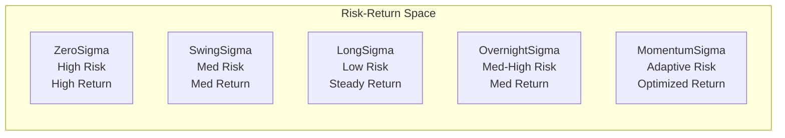

# Trading Packs

Trading Packs are pre-configured strategy templates designed for specific market conditions and time horizons. Each pack includes optimized indicators, risk parameters, and execution policies.

## 📦 Available Packs

### ZeroSigma (0DTE Options)

**Focus**: Same-day expiring options strategies  
**Horizon**: 0 days (intraday)  
**Risk Level**: High  
**Target Return**: 5-20% per trade  

#### Key Features
- Ultra-short-term momentum capture
- Options flow analysis integration
- Gamma scalping capabilities
- Real-time Greeks monitoring
- High-frequency execution

#### Ideal For
- Experienced options traders
- High risk tolerance
- Active monitoring capability
- Access to real-time data

#### Configuration
```python
{
  "pack_id": "zerosigma",
  "horizon": "0d",
  "cadence": "1min",
  "indicators": [
    "options_flow",
    "gamma_exposure",
    "RSI_1min",
    "VWAP",
    "order_imbalance"
  ],
  "risk_params": {
    "max_position_size": 0.02,  # 2% of capital
    "stop_loss": 0.15,           # 15% stop
    "time_stop": "15:30",        # Exit by 3:30 PM
    "max_daily_trades": 10
  }
}
```

### SwingSigma (Swing Trading)

**Focus**: Multi-day equity and options positions  
**Horizon**: 2-10 days  
**Risk Level**: Moderate  
**Target Return**: 3-8% per trade  

#### Key Features
- Trend following with momentum confirmation
- Support/resistance level detection
- Volume profile analysis
- Overnight gap strategies
- Position sizing based on volatility

#### Ideal For
- Part-time traders
- Moderate risk tolerance
- Cannot monitor markets continuously
- Prefer fewer, higher-quality trades

#### Configuration
```python
{
  "pack_id": "swingsigma",
  "horizon": "5d",
  "cadence": "daily",
  "indicators": [
    "SMA_20",
    "EMA_50",
    "RSI_14",
    "MACD",
    "ATR",
    "volume_profile"
  ],
  "risk_params": {
    "max_position_size": 0.05,  # 5% of capital
    "stop_loss": 0.08,           # 8% stop
    "take_profit": 0.15,         # 15% target
    "max_positions": 5
  }
}
```

### LongSigma (Long-term Investment)

**Focus**: Long-term equity positions  
**Horizon**: 63-252 days (3-12 months)  
**Risk Level**: Low  
**Target Return**: 15-30% annualized  

#### Key Features
- Fundamental analysis integration
- Sector rotation strategies
- Dividend capture optimization
- Tax-efficient positioning
- Portfolio rebalancing

#### Ideal For
- Long-term investors
- Low risk tolerance
- Tax-conscious strategies
- Retirement accounts

#### Configuration
```python
{
  "pack_id": "longsigma",
  "horizon": "126d",
  "cadence": "weekly",
  "indicators": [
    "SMA_50",
    "SMA_200",
    "earnings_momentum",
    "price_to_book",
    "sector_strength"
  ],
  "risk_params": {
    "max_position_size": 0.10,  # 10% of capital
    "stop_loss": 0.20,           # 20% stop
    "rebalance_frequency": "quarterly",
    "max_positions": 20
  }
}
```

### OvernightSigma (Gap Trading)

**Focus**: Close-to-open overnight positions  
**Horizon**: 1 day (overnight)  
**Risk Level**: Moderate-High  
**Target Return**: 1-3% per trade  

#### Key Features
- After-hours momentum analysis
- Earnings announcement plays
- News catalyst trading
- Pre-market volume analysis
- Gap fill strategies

#### Ideal For
- Traders with pre/post-market access
- News-driven strategies
- Moderate-high risk tolerance
- Small position sizes

#### Configuration
```python
{
  "pack_id": "overnightsigma",
  "horizon": "1d",
  "cadence": "1min",
  "indicators": [
    "after_hours_volume",
    "news_sentiment",
    "closing_imbalance",
    "RSI_5min",
    "gap_probability"
  ],
  "risk_params": {
    "max_position_size": 0.03,  # 3% of capital
    "stop_loss": 0.05,           # 5% stop
    "entry_time": "15:55",       # Enter near close
    "exit_time": "09:35",        # Exit after open
    "max_daily_positions": 3
  }
}
```

### MomentumSigma (Volatility-Scaled)

**Focus**: Adaptive momentum strategies  
**Horizon**: Variable (2-20 days)  
**Risk Level**: Moderate  
**Target Return**: Risk-adjusted optimal  

#### Key Features
- Dynamic position sizing
- Volatility regime detection
- Cross-asset momentum
- Correlation-based hedging
- Risk parity allocation

#### Ideal For
- Systematic traders
- Risk-conscious investors
- Multi-asset portfolios
- Adaptive strategies

#### Configuration
```python
{
  "pack_id": "momentumsigma",
  "horizon": "adaptive",
  "cadence": "dynamic",
  "indicators": [
    "momentum_score",
    "realized_volatility",
    "correlation_matrix",
    "sharpe_ratio_rolling",
    "regime_indicator"
  ],
  "risk_params": {
    "target_volatility": 0.15,   # 15% annual vol
    "max_leverage": 1.5,          # 1.5x leverage max
    "correlation_threshold": 0.7,  # Max correlation
    "rebalance_trigger": 0.10     # 10% drift trigger
  }
}
```

## 🎯 Pack Selection Guide

### Decision Matrix

| Factor | ZeroSigma | SwingSigma | LongSigma | OvernightSigma | MomentumSigma |
|--------|-----------|------------|-----------|----------------|---------------|
| **Time Commitment** | High | Medium | Low | Medium | Low |
| **Risk Level** | High | Moderate | Low | Mod-High | Moderate |
| **Capital Required** | $5K+ | $10K+ | $25K+ | $10K+ | $25K+ |
| **Monitoring Needs** | Constant | Daily | Weekly | Twice Daily | Daily |
| **Expertise Level** | Expert | Intermediate | Beginner | Intermediate | Advanced |
| **Market Conditions** | All | Trending | All | News-driven | All |

### Risk-Return Profiles



## 📊 Technical Indicators by Pack

### Core Indicator Sets

#### Momentum Indicators
- **RSI** (Relative Strength Index)
- **MACD** (Moving Average Convergence Divergence)
- **Stochastic Oscillator**
- **Williams %R**
- **CCI** (Commodity Channel Index)

#### Trend Indicators
- **SMA** (Simple Moving Average)
- **EMA** (Exponential Moving Average)
- **WMA** (Weighted Moving Average)
- **TEMA** (Triple Exponential Moving Average)
- **Ichimoku Cloud**

#### Volatility Indicators
- **Bollinger Bands**
- **ATR** (Average True Range)
- **Keltner Channels**
- **Donchian Channels**
- **Standard Deviation**

#### Volume Indicators
- **OBV** (On-Balance Volume)
- **Volume Profile**
- **VWAP** (Volume Weighted Average Price)
- **CMF** (Chaikin Money Flow)
- **Accumulation/Distribution**

### Pack-Specific Indicators

#### ZeroSigma Exclusive
- Options flow imbalance
- Gamma exposure levels
- Put/Call ratio
- IV rank/percentile
- Delta-neutral levels

#### SwingSigma Exclusive
- Support/Resistance levels
- Fibonacci retracements
- Gap analysis
- Trend strength index
- Pattern recognition

#### LongSigma Exclusive
- Fundamental scores
- Earnings momentum
- Sector rotation signals
- Dividend yield analysis
- Value metrics

## 🔧 Customization Options

### Creating Custom Packs

You can create custom packs by combining elements:

```python
custom_pack = {
  "pack_id": "custom_hybrid",
  "base_pack": "swingsigma",
  "modifications": {
    "horizon": "3d",
    "indicators": {
      "add": ["options_flow", "news_sentiment"],
      "remove": ["SMA_20"]
    },
    "risk_params": {
      "max_position_size": 0.04,
      "stop_loss": 0.06
    }
  }
}
```

### Pack Mixing Strategies

Combine multiple packs for diversification:

```python
portfolio_allocation = {
  "zerosigma": 0.20,    # 20% high-frequency
  "swingsigma": 0.40,   # 40% swing trading
  "longsigma": 0.30,    # 30% long-term
  "cash": 0.10          # 10% cash reserve
}
```

## 📈 Performance Metrics by Pack

### Historical Performance (Backtested)

| Pack | Avg Annual Return | Sharpe Ratio | Max Drawdown | Win Rate |
|------|------------------|--------------|--------------|----------|
| ZeroSigma | 45-80% | 1.2-1.8 | -25% | 58% |
| SwingSigma | 25-40% | 1.5-2.2 | -15% | 62% |
| LongSigma | 15-25% | 1.8-2.5 | -12% | 70% |
| OvernightSigma | 20-35% | 1.0-1.5 | -18% | 55% |
| MomentumSigma | 18-30% | 2.0-2.8 | -10% | 65% |

*Note: Past performance does not guarantee future results*

### Risk Gates by Pack

Each pack has specific risk gates that must pass:

#### ZeroSigma Gates
- Maximum daily loss < 5%
- Consecutive losses < 5
- Intraday drawdown < 10%
- Greeks within bounds

#### SwingSigma Gates
- Position drawdown < 8%
- Portfolio correlation < 0.8
- Sector concentration < 40%
- Beta-adjusted exposure < 1.5

#### LongSigma Gates
- Portfolio volatility < 20% annual
- Maximum position < 15%
- Minimum diversification: 10 positions
- Rebalancing frequency met

## 🚀 Getting Started with Packs

### Quick Start Commands

```bash
# List available packs
sigma-cli packs list

# Get pack details
sigma-cli packs describe zerosigma

# Create model from pack
sigma-cli models create --pack swingsigma --name "My Swing Strategy"

# Run pack-specific backtest
sigma-cli backtest run --pack longsigma --ticker AAPL
```

### API Usage

```python
from sigmatiq import PackManager

# Initialize pack manager
pm = PackManager()

# Get pack configuration
zero_config = pm.get_pack("zerosigma")

# Create model from pack
model = pm.create_model(
    pack_id="swingsigma",
    customizations={
        "ticker": "TSLA",
        "risk_profile": "Balanced"
    }
)

# Run pack-optimized backtest
results = pm.backtest(
    model_id=model.id,
    use_pack_defaults=True
)
```

## 📚 Pack Development

### Creating New Packs

To create a new trading pack:

1. Define the strategy thesis
2. Select appropriate indicators
3. Set risk parameters
4. Configure execution rules
5. Validate through backtesting

### Pack Template Structure

```yaml
pack_definition:
  metadata:
    id: "newpack"
    name: "New Trading Pack"
    version: "1.0.0"
    author: "Your Name"
    
  strategy:
    horizon: "5d"
    cadence: "hourly"
    asset_classes: ["equity", "options"]
    
  indicators:
    required: ["RSI", "MACD"]
    optional: ["BB", "ATR"]
    custom: ["your_custom_indicator"]
    
  risk_management:
    position_sizing: "kelly_criterion"
    stop_loss: "atr_based"
    take_profit: "risk_reward_ratio"
    
  execution:
    entry_rules: [...]
    exit_rules: [...]
    order_types: ["limit", "stop_limit"]
```

## 🔍 Pack Comparison Tool

Use our pack comparison tool to find the best fit:

```bash
sigma-cli packs compare --metrics sharpe,drawdown,returns
```

This generates a detailed comparison report with:
- Performance metrics
- Risk characteristics
- Suitable market conditions
- Capital requirements
- Expertise prerequisites

---

**Next Steps**: Learn about the [BTB Pipeline](BTB-Pipeline) or start with [Development Guide](Development-Guide)